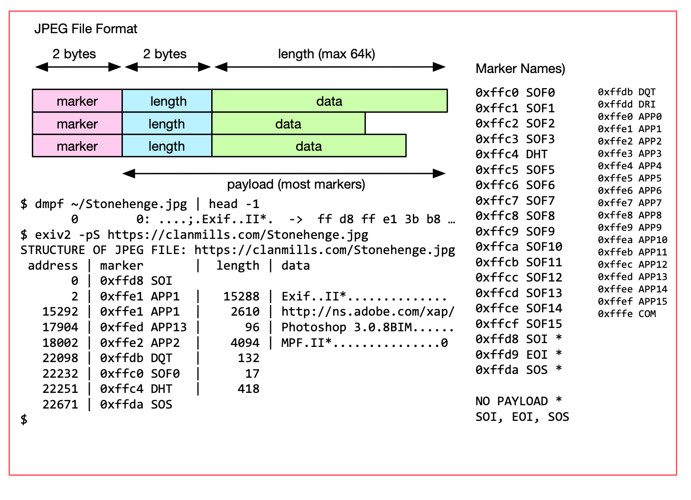
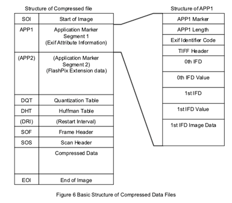
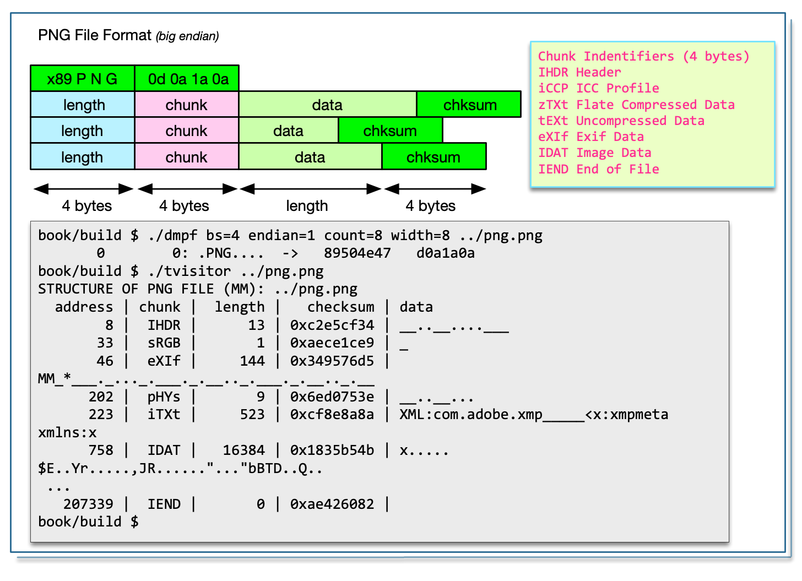
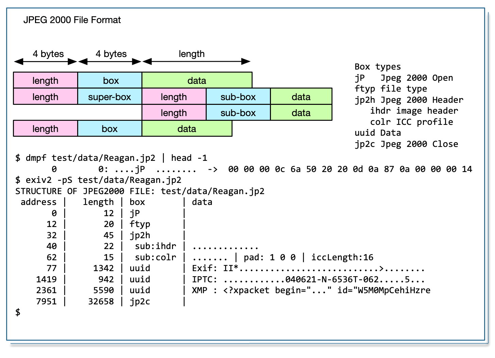
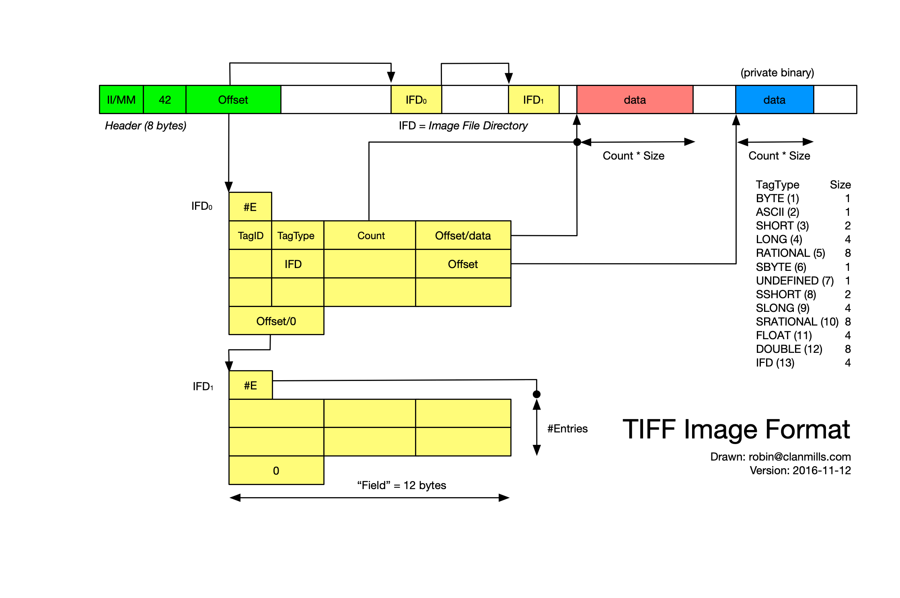
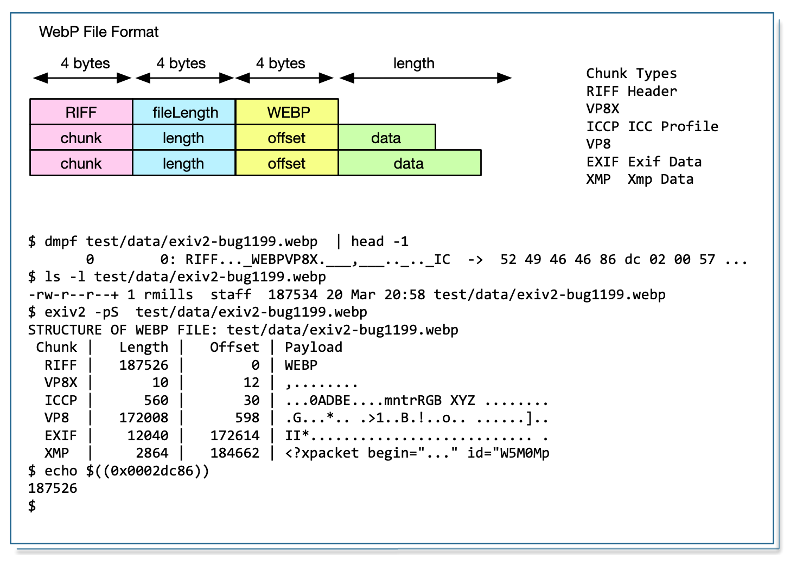
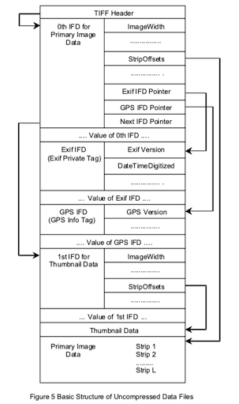

<div id="TOC">

# Image Metadata and Exiv2 Architecture

### TABLE OF CONTENTS

1. [Image File Formats](#1)<br>
[1 JPEG](#1-JPEG)<br>
[2 PNG](#1-PNG)<br>
[3 JP2](#1-JP2)<br>
[4 TIFF](#1-TIFF)<br>
[5 WebP](#1-WebP)<br>

2. [Tiff and Exif metadata](#2)
3. [MakerNotes](#3)
4. [Other metadata containers](#4)
5. [Lens Recognition](#5)
6. [Sample Applications](#6)
7. [I/O in Exiv2](#7)
8. [Exiv2 Architecture](#8)<br>
  [8.1 Tag Names in Exiv2](#8-1)<br>
  [8.2 Metadata Decoder](#8-2)<br>
  [8.3 Metadata Decoder](#8-3)<br>
  [8.4 Tiff Visitor](#8-4)<br>
  [8.5 printIFDStructure](#8-5)
9. [Test Suite and Build](#9)
10. [API/ABI](#10)
11. [Security](#11)
12. [Project Management, Release Engineering, User Support](#12)

A. [Appendix.  My home-made debugging tools   ](#a)

### Foreward

Before I start to discuss the subject of this book, I want to say "Thank You" to a few folks who have made this possbile.  First, my wife Alison, who has been my loyal support since the day we met in High School in 1967.  Secondly, I'd like to thank many people who have contributed to Exiv2 over the years.  In particular to Andreas Huggel the founder of the project and Luis and Dan who have worked tirelessly with me since 2017.  And (in alphabet order): Abhinav, Alan, Ben, Gilles, Kevin, Nehal, Neils, Mahesh, Phil, Thomas, Tuan .... and others who have contributed to Exiv2.

### About this book

This book is about Image Metadata and Exiv2 Architecture.

Image Metadata is the information stored in a digital image in addition to the image itself.  Data such as the camera model, date, time, location and camera setting are stored in the image file.  To my knowledge, no book has been written about this important technology.

Exiv2 Architecture is about the Exiv2 library and command-line application which implements cross-platform code in C++ to read, modify, insert and delete items of metadata.  I've been working on this code since 2008 and, as I approach my 70th birthday, would like to document my knowledge in the hope that the code will be maintained and developed by others in future.

### How did I get interested in this matter?

I first became interested in metadata because of a trail conversation with Dennis Connor in 2008.  Dennis and I ran frequently together in Silicon Valley and Dennis was a Software Development Manager in a company that made GPS systems for Precision Agriculture.  I had a Garmin Forerunner 201 Watch.  We realised that we could extract the GPS data from the watch in GPX format, then merge the position into photos.  Today this is called "GeoTagging" and is supported by many applications.  However in 2008, we had never heard the term "GeoTagging".


I said "Oh, it can't be too difficult to do that!".  And here we are more than a decade later still working on the project.  The program geotag.py was completed in about 6 weeks.  Most of the effort went into porting both Exiv2 and pyexiv2 to Visual Studio and macOS as both were Linux only at that time.

The sample application samples/geotag.cpp provides a command line utility to geotag photos and I frequently use this on my own photographs.  Today, I have a Samsung Galaxy Watch which uploads runs to Strava.  I download the GPX from Strava.  The date/time information in the JPG is the key to search for the position data.  The GPS tags are created and saved in the image.

Back in 2008, I wanted to implement this in python as it was a good excuse to learn Python.  Having discovered exiv2 and the python wrapper pyexiv2, I set off with enthusiasm to build a cross-platform script to run on **Windows** _(XP, Visual Studio 2003)_, **Ubuntu Linux** _(Hardy Heron 2008.04 LTS)_ and **macOS** _(32 bit Tiger 10.4 on a big-endian PPC)_.  After I finished, I emailed Andreas.  He responded in less than an hour and invited me to join Team Exiv2.  Initialially, I provided support to build Exiv2 with Visual Studio.

Incidentally, later in 2008, Dennis offered me a contract to port his company's Linux code to Visual Studio to be used on a Windows CE Embedded Controller.  1 million lines of C++ were ported from Linux in 6 weeks.  I worked with Dennis for 4 years on all manner of GPS related software development.

[https://clanmills.com/articles/gpsexiftags/](https://clanmills.com/articles/gpsexiftags/)

I have never been employed to work on Metadata.  I was a Senior Computer Scientist at Adobe for more than 10 years, however I was never involved with XMP or Metadata.

### 2012 - 2017

By 2012, Andreas was loosing interest in Exiv2.  Like all folks, he has many matters which deserve his time.  A family, a business, biking and other pursuits.  From 2012 until 2017, I supported Exiv2 mostly alone.  I had lots of encouragement from Alan and other occasional contributors.  Neils did great work on lens recognition and compatibility with ExifTool.  Ben helped greatly with WebP support and managed the transition of the code from SVN to GitHub.  Phil (of ExifTool fame) has been very supportive and helpful.

I must also mention our adventures with Google Summer of Cocde and our students Abhinav, Tuan and Mahesh.  GSoC is a program at Google to sponsor students to contribute to open source projects. 1200 Students from around the world are given a bounty of $5000 to contribute 500 hours to a project over summer recess.  The projects are supervised by a mentor.  Exiv2 is considered to be part of the KDE family of projects.  Within KDE, there a sub-group of Graphics applications and Technology.  We advertised our projects, the students wrote proposals and some were accepted by Google on the Recommendation of the KDE/Graphics group.

In 2012, Abhinav joined us and contributed the Video read code and was mentored by Andreas.  In 2013, Tuan joined us and contributed the WebReady code and was mentored by me.  Mahesh also joined us and contribute the Video write code and was mentored by Abhinav.

I personally found working with the students to be enjoyable and interesting.  I retired from work in 2014 and returned to England after 15 years in Silicon Valley.  In 2016, Alison and I had a trip round the world and spent a day with Mahesh in Bangalore and with Tuan in Singapore.  We subsequently went to Vietnam to attend Tuan's wedding in 2017.

### How did I get involved with Exiv2?

I started working on Exiv2 to implement GeoTagging.  As the years have passed, I've explored most of the code.  And I've added new capability such as support for ICC profiles, metadata-piping and file-debugging.  I've done lots of work on the build and test apparatus.  I've talked to users all over the world and closed several hundred issues and feature requests.  After I retired, Alison and I had a trip around the world.  We were invited to stay with Andreas and his family.  We met users in India, Singapore, Armenia, the USA and the UK.  And I've attended 3 Open-Source Conferences. It's been an adventure and mostly rewarding.  It's remarkable how seldom users express appreciation.

### Where are we now?

After v0.26 was released in 2017, Luis and Dan started making contributions.  They have made many important contributions in the areas of security, test and build.  In 2019, Kevin joined us.  He discovered and fixed some security issues.

The current release of Exiv2 is v0.27.3 and was released on 2020-06-30.  I hope to release v0.28 in Fall 2020.  Further "dot" releases of v0.27 may be published for security fixes in future.

The Libre Graphics Meeting is scheduled to take place in May 2021 in Rennes, France.  I intend to lead a workshop on Image Metadata and Exiv2 Architecture.  This book is being written to be used in that presentation.

### Current Development Priorities

In July 2017 we received our first security CVE.  Not a pleasant experience.  The security folks started hitting us with fuzzed files. These are files which violate format specifications and can cause the code to crash. We responded with v0.27 which will have regular "dot" releases to provide security fixes.  Managing frequent releases and user correspondence consumes lots of my time.

In parallel to "the dots", major work is being carried to prepare Exiv2 for the future. Dan and Luis are working on v0.28 which will be released in 2020. This is a considerable reworking of the code into C++11.

I'm delighted by the work done by Dan, Luis and Kevin to deal with the assault of the security people. I believe we are responding effectively to security issues. None-the-less, they have dominated the development of Exiv2 for the last couple of years and many ideas could not be persued because security has consumed our engineering resources.

### Purpose and Scope of this book

This book is my legacy to Exiv2.  I hope Exiv2 will continue to exist long into the future and this book is being written to document my discoveries about Image Metadata and Exiv2 Architecture.  However, I want to avoid a "cut'n'paste" of information already in the project documentation.  This book is an effort to collect my knowledge of this code into a single accessible location.  Many topics in this book are discussed in more detail in the issues stored in Redmine and GitHub.  Of course, finding those discussions isn't easy.  I hope this book helps future maintainers to understand Exiv2, solve issues and develop the code for years to come.

[TOC](#TOC)

<div id="1">
# 1 Image File Formats

The following summaries of the file formats are provided to help reader understand both this book and the Exiv2 code.  The specifications should be consulted for more details.

<div id="1-JPEG">
### 1.1 JPEG




[TOC](#TOC)


<div id="1-PNG">
### 1.2 PNG


[TOC](#TOC)

<div id="1-JP2">
### 1.3 JPEG 2000


[TOC](#TOC)

<div id="1-TIFF">
### 1.4 TIFF


[TOC](#TOC)

<div id="1-WebP">
### 1.5 WEBP


[TOC](#TOC)

<div id="2">
# 2 Tiff and Exif metadata



Before we get into the Exiv2 code, let's look at the simpler python JPG/TIFF Exif library: [https://github.com/Moustikitos/tyf](https://github.com/Moustikitos/tyf)

This is a library and I've constructed a simple wrapper to reveal the Exif metadata.

```python
#!/usr/bin/env python3

import Tyf
import os
import sys

##
#
def dumpTags(ifd):
	for tag in ifd:
		V=tag[1]
		v=str(V)
		if type(V)==type(''):
			v='"'+v+'"'
		if len(v) > 50:
		   v = v[0:48] + '...'
		t=str(type(V))
		t=t[8:len(t)-2]
		if t == 'bytes':
			t=str(len(V)) + ' ' + t
		elif t == 'str':
			t=str(len(V))
		t='('+t+')'

		print('%s -> %s %s' % ( tag[0], v , t)	)

##
#
def main(argv):
	"""main - main program of course"""

	image = Tyf.open(argv[1])
	# help(jpg)

	if str(type(image)) == "<class 'Tyf.TiffFile'>":
		dumpTags(image[0])
	elif str(type(image)) == "<class 'Tyf.JpegFile'>":
		dumpTags(image.ifd0)
	else:
		print("unknown image type " + str(type(image)))

if __name__ == '__main__':
	main(sys.argv)

# That's all Folks
##
```

You can obtain Stonehenge.jpg from https://clanmills.com/Stonehenge.jpg
The tiff version is available in test/data/Stonehenge.tif

```
$ ~/bin/mdump.py  ~/Stonehenge.jpg           $ ~/bin/mdump.py  ~/Stonehenge.jpg
Make -> "NIKON CORPORATION" (17)             ImageLength -> 1 (int)
Model -> "NIKON D5300" (11)                  BitsPerSample -> (8, 8, 8, 8) 
Orientation -> 1 (int)                       Compression -> 1 (int)
XResolution -> 300.0 (float)                 PhotometricInterpretation -> 2
YResolution -> 300.0 (float)                 FillOrder -> 1 (int)
ResolutionUnit -> 2 (int)                    ImageDescription -> "Classic V
Software -> "Ver.1.00 " (9)                  Make -> "NIKON CORPORATION" (1
DateTime -> 2015-07-16 20:25:28 (datetim     Model -> "NIKON D5300" (11)
YCbCrPositioning -> 1 (int)                  StripOffsets -> 901 (int)
Exif IFD -> 222 (int)                        Orientation -> 1 (int)
GPS IFD -> 4060 (int)                        SamplesPerPixel -> 4 (int)
ExposureTime -> 0.0025 (float)               RowsPerStrip -> 1 (int)
FNumber -> 10.0 (float)                      StripByteCounts -> 4 (int)
ExposureProgram -> 0 (int)                   XResolution -> 100.0 (float)
ISOSpeedRatings -> 200 (int)                 YResolution -> 100.0 (float)
ExifVersion -> b'0230' (4 bytes)             PlanarConfiguration -> 1 (int)
DateTimeOriginal -> 2015-07-16 15:38:54      ResolutionUnit -> 2 (int)
DateTimeDigitized -> 2015-07-16 15:38:54     Software -> "Ver.1.00 " (9)
ComponentsConfiguration -> b\x01\x02\x0      DateTime -> 2015-07-16 20:25:2
CompressedBitsPerPixel -> 2.0 (float)        ExtraSamples -> 1 (int)
ExposureBiasValue -> (0, 6) (tuple)          SampleFormat -> (1, 1, 1, 1) (
MaxApertureValue -> 4.3 (float)              XMP -> (60, 120, 58, 120, 109,
MeteringMode -> 5 (int)                      IPTC -> b'\x1c\x01Z\x00\x03\x1
LightSource -> 0 (int)                       Exif IFD -> 8 (int)
Flash -> 16 (int)                            ICC Profile -> b'\x00\x00\x0cH
FocalLength -> 44.0 (float)                  GPS IFD -> 655 (int)
MakerNote -> b'Nikon\x00\x02\x11\x00\x00'    ExposureTime -> 0.0025 (float)
UserComment ->                               FNumber -> 10.0 (float)
SubsecTime -> "00" (2)                       ExposureProgram -> 0 (int)
SubsecTimeOriginal -> "00" (2)               ISOSpeedRatings -> 200 (int)
SubsecTimeDigitized -> "00" (2)              ExifVersion -> b'0230' (4 byte
FlashpixVersion -> b'0100' (4 bytes)         DateTimeOriginal -> 2015-07-16
ColorSpace -> 1 (int)                        DateTimeDigitized -> 2015-07-1
PixelXDimension -> 6000 (int)                ComponentsConfiguration -> b'\
PixelYDimension -> 4000 (int)                CompressedBitsPerPixel -> 2.0 
Interoperability IFD -> 4306 (int)           ExposureBiasValue -> (0, 1) (t
SensingMethod -> 2 (int)                     MaxApertureValue -> 4.3 (float
FileSource -> b'\x03' (1 bytes)              MeteringMode -> 5 (int)
SceneType -> b'\x01' (1 bytes)               LightSource -> 0 (int)
CFAPattern -> b'\x02\x00\x02\x00\x00\x01     Flash -> 16 (int)
CustomRendered -> 0 (int)                    FocalLength -> 44.0 (float)
ExposureMode -> 0 (int)                      UserComment -> 
WhiteBalance -> 0 (int)                      SubsecTime -> "00" (2)
DigitalZoomRatio -> 1.0 (float)              SubsecTimeOriginal -> "00" (2)
FocalLengthIn35mmFilm -> 66 (int)            SubsecTimeDigitized -> "00" (2
SceneCaptureType -> 0 (int)                  FlashpixVersion -> b'0100' (4 
GainControl -> 0 (int)                       ColorSpace -> 1 (int)
Contrast -> 0 (int)                          PixelXDimension -> 1 (int)
Saturation -> 0 (int)                        PixelYDimension -> 1 (int)
Sharpness -> 0 (int)                         SensingMethod -> 2 (int)
SubjectDistanceRange -> 0 (int)              FileSource -> b'\x03' (1 bytes
ImageUniqueID -> "090caaf2c085f3e102513b     SceneType -> b'\x01' (1 bytes)
InteropIndex -> "R98" (3)                    CustomRendered -> 0 (int)
InteropVersion -> b'0100' (4 bytes)          ExposureMode -> 0 (int)
GPSLatitudeRef -> 1 (int)                    WhiteBalance -> 0 (int)
GPSLatitude -> 51.17828166666666 (float)     DigitalZoomRatio -> 1.0 (float
GPSLongitudeRef -> -1 (int)                  FocalLengthIn35mmFilm -> 66 (i
GPSLongitude -> 1.8266399999999998 (floa     SceneCaptureType -> 0 (int)
GPSAltitudeRef -> -1 (int)                   GainControl -> 0 (int)
GPSAltitude -> 97.0 (float)                  Contrast -> 0 (int)
GPSTimeStamp -> 14:38:55 (datetime.time)     Saturation -> 0 (int)
GPSSatellites -> "09" (2)                    Sharpness -> 0 (int)
GPSMapDatum -> "WGS-84          " (16)       SubjectDistanceRange -> 0 (int
GPSDateStamp -> 2015-07-16 00:00:00 (dat     ImageUniqueID -> "090caaf..."
                                             GPSLatitudeRef -> 1 (int)
                                             GPSLatitude -> 51.178280555555
                                             GPSLongitudeRef -> -1 (int)
                                             GPSLongitude -> 1.826638888888
                                             GPSAltitudeRef -> -1 (int)
                                             GPSAltitude -> 97.0 (float)
                                             GPSTimeStamp -> 14:38:55 (date
                                             GPSSatellites -> "09" (2)
                                             GPSMapDatum -> "WGS-84"        
                                             GPSDateStamp -> 2015-07-16 00:
```

Data's similar.  The order is different.  Good news is that the commands `$ exiv2 -pe ~/Stonehenge.jpg` and `$ exiv2 -pe ~/Stonehenge.tif`produce similar data in the same order.  We'd hope so and both codes read the same data.

[TOC](#TOC)

<div id="3">
# 3 MakerNotes

<div id="4">
# 4 Other metadata containers

Exif is the most important of the metadata containers.  However the other exist and are supported by Exiv2:


| Type | Definition | Comment |
|:---  |:----       |:------  |
| EXIF | EXchangeable Image Format | Japanese Electronic Industry Development Association Standard |
| IPTC | International Press Telecommunications Council  | Press Industry Standard |
| Xmp  | Extensible Metadata Platform | Adobe Standard |
| ICC  | International Color Consortium | Industry Consortium for Color Handling Standards |
| ImageMagick/PNG | Portable Network Graphics | Not implemented in Exiv2 |

[TOC](#TOC)

<div id="5">
# 5 Lens Recognition
[TOC](#TOC)

<div id="6">
# 6 Sample Applications
[TOC](#TOC)

<div id="7">
# 7 I/O in Exiv2
[TOC](#TOC)

<div id="8">
# 8 Exiv2 Architecture
[TOC](#TOC)

<div id="8-1">
### 8.1 Tag Names in Exiv2

The following test program is very useful for understanding tags:

```
$ taglist --help
Usage: taglist [--help]
           [--group name|
            Groups|Exif|Canon|CanonCs|CanonSi|CanonCf|Fujifilm|Minolta|Nikon1|Nikon2|Nikon3|Olympus|
            Panasonic|Pentax|Sigma|Sony|Iptc|
            dc|xmp|xmpRights|xmpMM|xmpBJ|xmpTPg|xmpDM|pdf|photoshop|crs|tiff|exif|aux|iptc|all|ALL
           ]
Print Exif tags, MakerNote tags, or Iptc datasets
```

Let me explain what the tag names mean.

Tag: Family.Group.TagName<br>
Family: Exif | Iptc | Xmp<br>
Group : There are 106 groups:

```
$ taglist Groups | wc
     106     106    1016
$ taglist Groups | grep Minolta
Minolta
MinoltaCs5D
MinoltaCs7D
MinoltaCsOld
MinoltaCsNew
SonyMinolta
$
```

TagName: Can be almost anything and depends on the Group.

```
$ taglist MinoltaCsNew
ExposureMode,	1,	0x0001,	MinoltaCsNew,	Exif.MinoltaCsNew.ExposureMode,	Long,	Exposure mode
FlashMode,	2,	0x0002,	MinoltaCsNew,	Exif.MinoltaCsNew.FlashMode,	Long,	Flash mode
...
FlashMetering,	63,	0x003f,	MinoltaCsNew,	Exif.MinoltaCsNew.FlashMetering,	Long,	Flash metering
$
```

There isn't a tag Exif.MinoltaCsNew.ISOSpeed.  There is a Exif.MinoltaCSNew.ISO

```
$ taglist all | grep ISOSpeed$         $ taglist all | grep \\.ISO$
Photo.ISOSpeed                         Casio.ISO
PanasonicRaw.ISOSpeed                  Casio2.ISO
CanonCs.ISOSpeed                       MinoltaCsOld.ISO
CanonSi.ISOSpeed                       MinoltaCsNew.ISO
Casio2.ISOSpeed                        NikonIi.ISO
MinoltaCs5D.ISOSpeed                   NikonSiD300a.ISO
MinoltaCs7D.ISOSpeed                   NikonSiD300b.ISO
Nikon1.ISOSpeed                        NikonSi02xx.ISO
Nikon2.ISOSpeed                        NikonSi01xx.ISO
Nikon3.ISOSpeed                        PentaxDng.ISO
Olympus.ISOSpeed                       Pentax.ISO
Olympus2.ISOSpeed                      Samsung2.ISO
Sony1MltCs7D.ISOSpeed                  Sony1MltCsOld.ISO
                                       Sony1MltCsNew.ISO

```

You can use the program exifvalue to look for a tag in a file.  If the tag doesn't exist in the file, it will report "value not set":

```
$ exifvalue ~/Stonehenge.jpg Exif.MinoltaCsNew.ISO
Caught Exiv2 exception 'Value not set'
$
```

If the tag is not known, it will report 'Invalid tag':

```
$ exifvalue ~/Stonehenge.jpg Exif.MinoltaCsNew.ISOSpeed
Caught Exiv2 exception 'Invalid tag name or ifdId `ISOSpeed', ifdId 37'
$
```

Is there a way to report every tag known to exiv2?  Yes.  There are 5430 known tags:

```
$ for group in $(taglist Groups); do for tag in $(taglist $group | cut -d, -f 1) ; do echo $group.$tag ; done; done
Image.ProcessingSoftware
Image.NewSubfileType
Image.SubfileType
Image.ImageWidth
...
$ for group in $(taglist Groups); do for tag in $(taglist $group | cut -d, -f 1) ; do echo $group.$tag ; done; done | wc
    5430    5430  130555
$
```

Now, let me explain why there are 106 groups.  There are about 10 camera manufacturers (Canon, Minolta, Nikon etc) and they use the tag Exif.Photo.MakerNote to store data in a myriad of different (and proprietary standards).

```
$ exifvalue ~/Stonehenge.jpg Exif.Photo.MakerNote
78 105 107 111 110 0 2 ...
```

Exiv2 has code to read/modify/write makernotes.  All achieved by reverse engineering.  References on the web site.

The MakerNote usually isn't a simple structure.  The manufacturer usually has "sub-records" for Camera Settings (Cs), AutoFocus (Af) and so on.  Additionally, t ehe format of the sub-records can evolve and change with time.  For example (as above)

```
$ taglist Groups | grep Minolta
Minolta
MinoltaCs5D
MinoltaCs7D
MinoltaCsOld
MinoltaCsNew
SonyMinolta
$
```

So, Minolta have 6 "sub-records".  Other manufacturers have more.  Let's say 10 manufacturers have an average of 10 "sub-records".  That's 100 groups.

Now to address your concern about `Exif.MinoltaCsNew.ISOSpeed`.  It will throw an exception in Exiv2 v0.27.2.  Was it defined in an earlier version of Exiv2 such as 0.21?  I don't know.

Your application code has to use exception handlers to catch these matters and determine what to do.  Without getting involved with your application code, I can't comment on your best approach to dealing with this.  There is a macro EXIV2_TEST_VERSION which enables you to have version specific code in your application.

[TOC](#TOC)

<div id="8-2">
### 8.2 Metadata Decoder

Please read: [#988](https://github.com/Exiv2/exiv2/pull/988)

This PR uses a decoder listed in TiffMappingInfo to decode Exif.Canon.AFInfo. The decoding function "manufactures" Exif tags such as Exif.Canon.AFNumPoints from the data in Exif.Canon.AFInfo. These tags must never be written to file and are removed from the metadata in exif.cpp/ExifParser::encode().

Three of the tags created (AFPointsInFocus,AFPointsSelected, AFPrimaryPoint) are bitmasks. As the camera can have up to 64 focus points, the tags are a 64 bit mask to say which points are active. The function printBitmask() reports data such as 1,2,3 or (none).

This decoding function decodeCanonAFInfo() added to TiffMappingInfo manufactures the new tags. Normally, tags are processed by the binary tag decoder and that approach was taken in branch fix981_canonAf. However, the binary tag decoder cannot deal with AFInfo because the size of some metadata arrays cannot be determined at compile time.

We should support decoding AFInfo in 0.28, however we should NOT auto-port this PR. We can avoid having to explicitly delete tags from the metadata before writing by adding a "read-only" flag to TagInfo. This would break the Exiv2 v0.27 API and has been avoided. There is an array in decodeCanonAFInfo() which lists the "manufactured" tags such as Exif.Canon.AFNumPoints. In the Exiv2 v0.28 architecture, a way might be designed to generate that data at run-time.

[TOC](#TOC)

<div id="8-3">
### 8.3 Metadata Binary Tag Decoder

Please read: [#900](https://github.com/Exiv2/exiv2/pull/900)

There is a long discussion in [#646](https://github.com/Exiv2/exiv2/pull/646) about this issue and my investigation into the how the makernotes are decoded.

### History

The tag for Nikon's AutoFocus data is 0x00b7

Nikon encode their version of tag in the first 4 bytes.  There was a 40 byte version of AutoFocus which decodes as Exif.NikonAf2.XXX.  This new version (1.01) is 84 bytes in length and decoded as Exif.NikonAf22.XXX.

The two versions (NikonAF2 and NikonAF22) are now encoded as a set with the selector in tiffimage_int.cpp

```
    extern const ArraySet nikonAf2Set[] = {
        { nikonAf21Cfg, nikonAf21Def, EXV_COUNTOF(nikonAf21Def) },
        { nikonAf22Cfg, nikonAf22Def, EXV_COUNTOF(nikonAf22Def) },
    };
```

The binary layout of the record is defined in tiff image_int.cpp.  For example, AF22 is:

```
    extern const ArrayCfg nikonAf22Cfg = {
        nikonAf22Id,      // Group for the elements
        littleEndian,     // Byte order
        ttUndefined,      // Type for array entry
        notEncrypted,     // Not encrypted
        false,            // No size element
        true,             // Write all tags
        true,            // Concatenate gaps
        { 0, ttUnsignedByte,  1 }
    };
    //! Nikon Auto Focus 22 binary array - definition
    extern const ArrayDef nikonAf22Def[] = {
        {  0, ttUndefined,     4 }, // Version
        {  4, ttUnsignedByte,  1 }, // ContrastDetectAF
        {  5, ttUnsignedByte,  1 }, // AFAreaMode
        {  6, ttUnsignedByte,  1 }, // PhaseDetectAF
        {  7, ttUnsignedByte,  1 }, // PrimaryAFPoint
        {  8, ttUnsignedByte,  7 }, // AFPointsUsed
        { 70, ttUnsignedShort, 1 }, // AFImageWidth
        { 72, ttUnsignedShort, 1 }, // AFImageHeight
        { 74, ttUnsignedShort, 1 }, // AFAreaXPosition
        { 76, ttUnsignedShort, 1 }, // AFAreaYPosition
        { 78, ttUnsignedShort, 1 }, // AFAreaWidth
        { 80, ttUnsignedShort, 1 }, // AFAreaHeight
    };
```

The two versions of the data are encoded in tiffimage_int.cpp

```
        { Tag::root, nikonAf21Id,      nikon3Id,         0x00b7    },
        { Tag::root, nikonAf22Id,      nikon3Id,         0x00b7    },
```

### Binary Selector

The code to determine which version is decoded is in tiffimage_int.cpp

```
       {    0x00b7, nikon3Id,         EXV_COMPLEX_BINARY_ARRAY(nikonAf2Set, nikonAf2Selector) },
```

When the tiffvisitor encounters 0x00b7, he calls nikonAf2Selector() to return the index of the binary array to be used.  By default it returns 0 (the existing `nikonAf21Id`).  If the tag length is 84, he returns 1 for `nikonAf21Id`

```
    int nikonAf2Selector(uint16_t tag, const byte* /*pData*/, uint32_t size, TiffComponent* const /*pRoot*/)
    {
        int result = tag == 0x00b7 ? 0 : -1 ;
        if (result > -1 && size == 84 ) {
            result = 1;
        }
        return result;
    }
```

### The decoder

```
EXV_CALL_MEMBER_FN(*this, decoderFct)(object);
```

This function understands how to decode byte-by-byte from `const ArrayDef` into the Exiv2 tag/values such as Exif.NikonAF22.AFAreaYPosition which it stores in the ExifData vector.

This is ingenious magic.  I'll revisit/edit this explanation in the next few days when I have more time to explain this with more clarity.


[TOC](#TOC)

<div id="8-4">
### 8.4 Tiff Visitor

The tiff visitor code is based on the visitor pattern in [Design Patterns: Elements of Reusable Object=Oriented Software](https://www.oreilly.com/library/view/design-patterns-elements/0201633612/).  Before we discuss tiff visitor, let's review the visitor pattern.

The TiffVisitor is ingenious.  It's also difficult to understand.  Exiv2 has two tiff parsers - TiffVisitor and printStructure().  TiffVisitor was written by Andreas Huggel.  It's very robust and has been almost 
bug free for 15 years.  I wrote the parser in printStructure() to try to understand the structure of a tiff file.  The code in printIFDStructure() is much easier to understand.

The concept in the visitor pattern is to separate the data in an object from the code which that has an interest in the object.  It the following code, we have a vector of students and every student has a name and an age.  We have two visitors.  The French Visitor translates the names of the students.  The AverageAgeVisitor calculates the average age of the visitor.  Two points to recognise in the pattern:

1.  The students know nothing about the visitors.  If the visitors have a public API, the students can obtain data about the visitor.

2.  The visitors use the student API to get data about a student.

```
// visitor.cpp
#include <iostream>
#include <string>
#include <vector>
#include <map>

// 1.  declare types
class   Student; // forward

// 2. Create abstr act base class with a student visit() method
class Visitor
{
public:
    Visitor() {};
    virtual void visit(Student& student) = 0 ;
};

// 3. Student has an accept(Visitor&) method, an API and private data
class Student
{
public:
    Student(std::string name,int age) : name_(name), age_(age) {}
    void accept(class Visitor& v) { v.visit(*this); }

//  API
    std::string name()  { return name_; } 
    int         age()   { return age_;  }
private:
    std::string name_ ;
    int         age_  ;
};

// 4. Create concrete "visitors"
class FrenchVisitor: public Visitor
{
public:
    FrenchVisitor()
    {
    	dictionary_["this"]      = "ce"      ;
    	dictionary_["that"]      = "que"     ;
    	dictionary_["the other"] = "l'autre" ;
    }
    void visit(Student& student)
    {
        std::cout << "FrenchVisitor: " << dictionary_[student.name()] << std::endl;
    }
private:
    std::map<std::string,std::string> dictionary_;
};

class AverageAgeVisitor: public Visitor
{
public:
    AverageAgeVisitor() : students_(0), years_(0) {}
    void visit(Student& student)
    {
        students_ ++ ;
        years_    += student.age();
    }
    void reportAverageAge() 
    {
        std::cout << "average age = "  << (double) years_ / (double) students_ << std::endl ;
    }
private:
    int years_;
    int students_;
};

int main() {
    // create students
    std::vector<Student>   students;
    students.push_back(Student("this",10)     );
    students.push_back(Student("that",12)     );
    students.push_back(Student("the other",14));

    // traverse/visit each student
    FrenchVisitor    frenchVisitor;
    for ( std::vector<Student>::iterator student = students.begin() ; student != students.end() ; student++ ) {
        student->accept(frenchVisitor);
    }

    AverageAgeVisitor averageAgeVisitor;
    for ( std::vector<Student>::iterator student = students.begin() ; student != students.end() ; student++ ) {
        student->accept(averageAgeVisitor);
    }
    averageAgeVisitor.reportAverageAge();

    return 0 ;
}
```

And when we run it:

```
1181 rmills@rmillsmbp:~/gnu/exiv2/team/book/build $ ./visitor 
FrenchVisitor: ce
FrenchVisitor: que
FrenchVisitor: l'autre
average age = 12
1158 rmills@rmillsmbp:~/gnu/exiv2/team/book/build $ 
```

Exiv2 has an abstract TiffVisitor class, and the following concrete visitors:

```
tiffvisitor_int.hpp:    class TiffFinder  : public TiffVisitor 
tiffvisitor_int.hpp:    class TiffCopier  : public TiffVisitor 
tiffvisitor_int.hpp:    class TiffDecoder : public TiffVisitor 
tiffvisitor_int.hpp:    class TiffEncoder : public TiffVisitor
tiffvisitor_int.hpp:    class TiffReader  : public TiffVisitor
```

I'll write more about the TiffVisitor later.

<div id="8-5">
### 8.5 printIFDStructure

It's important to realise that metadata is defined recursively.  In a Tiff File, there will be a Tiff Record containing the Exif data (written in Tiff Format).  Within, that Record, there will be MakerNote, also written in Tiff Format.  Tiff Format is referred to as an IFD - an Image File Directory.

The printIFDStructure() parser uses a simple direct approach to parsing the tiff file.  When another IFD is located, printStructure is called recursively.  As a TIFF file is an IFD, we can descend into the tiff file from the beginning.  For other files types, the file handler has to find the Exif IFD and then call printIFDStructure().

```
void Image::printIFDStructure(BasicIo& io, std::ostream& out, Exiv2::PrintStructureOption option,uint32_t start,bool bSwap,char c,int depth)
{
    depth++;
    bool bFirst  = true  ;

    // buffer
    const size_t dirSize = 32;
    DataBuf  dir(dirSize);
    bool bPrint = option == kpsBasic || option == kpsRecursive;

    do {
        // Read top of directory
        const int seekSuccess = !io.seek(start,BasicIo::beg);
        const long bytesRead = io.read(dir.pData_, 2);
        if (!seekSuccess || bytesRead == 0) {
            throw Error(kerCorruptedMetadata);
        }
        uint16_t   dirLength = byteSwap2(dir,0,bSwap);

        bool tooBig = dirLength > 500;
        if ( tooBig ) throw Error(kerTiffDirectoryTooLarge);

        if ( bFirst && bPrint ) {
            out << Internal::indent(depth) << Internal::stringFormat("STRUCTURE OF TIFF FILE (%c%c): ",c,c) << io.path() << std::endl;
            if ( tooBig ) out << Internal::indent(depth) << "dirLength = " << dirLength << std::endl;
        }

        // Read the dictionary
        for ( int i = 0 ; i < dirLength ; i ++ ) {
            if ( bFirst && bPrint ) {
                out << Internal::indent(depth)
                    << " address |    tag                              |     "
                    << " type |    count |    offset | value\n";
            }
            bFirst = false;

            io.read(dir.pData_, 12);
            uint16_t tag    = byteSwap2(dir,0,bSwap);
            uint16_t type   = byteSwap2(dir,2,bSwap);
            uint32_t count  = byteSwap4(dir,4,bSwap);
            uint32_t offset = byteSwap4(dir,8,bSwap);

            // Break for unknown tag types else we may segfault.
            if ( !typeValid(type) ) {
                std::cerr << "invalid type in tiff structure" << type << std::endl;
                start = 0; // break from do loop
                throw Error(kerInvalidTypeValue);
            }

            std::string sp  = "" ; // output spacer

            //prepare to print the value
            uint32_t kount  = isPrintXMP(tag,option) ? count // haul in all the data
                            : isPrintICC(tag,option) ? count // ditto
                            : isStringType(type)     ? (count > 32 ? 32 : count) // restrict long arrays
                            : count > 5              ? 5
                            : count
                            ;
            uint32_t pad    = isStringType(type) ? 1 : 0;
            uint32_t size   = isStringType(type) ? 1
                            : is2ByteType(type)  ? 2
                            : is4ByteType(type)  ? 4
                            : is8ByteType(type)  ? 8
                            : 1
                            ;

            long long allocate = (long long) size*count + pad+20;
            if ( allocate > (long long) io.size() ) {
                throw Error(kerInvalidMalloc);
            }
            DataBuf  buf((long)allocate);  // allocate a buffer
            std::memset(buf.pData_, 0, buf.size_);
            std::memcpy(buf.pData_,dir.pData_+8,4);  // copy dir[8:11] into buffer (short strings)
            const bool bOffsetIsPointer = count*size > 4;

            if ( bOffsetIsPointer ) {          // read into buffer
                size_t   restore = io.tell();  // save
                io.seek(offset,BasicIo::beg);  // position
                io.read(buf.pData_,count*size);// read
                io.seek(restore,BasicIo::beg); // restore
            }

            if ( bPrint ) {
                const uint32_t address = start + 2 + i*12 ;
                const std::string offsetString = bOffsetIsPointer?
                    Internal::stringFormat("%10u", offset):
                    "";

                out << Internal::indent(depth)
                << Internal::stringFormat("%8u | %#06x %-28s |%10s |%9u |%10s | "
                                          ,address,tag,tagName(tag).c_str(),typeName(type),count,offsetString.c_str());
                if ( isShortType(type) ){
                    for ( size_t k = 0 ; k < kount ; k++ ) {
                        out << sp << byteSwap2(buf,k*size,bSwap);
                        sp = " ";
                    }
                } else if ( isLongType(type) ){
                    for ( size_t k = 0 ; k < kount ; k++ ) {
                        out << sp << byteSwap4(buf,k*size,bSwap);
                        sp = " ";
                    }

                } else if ( isRationalType(type) ){
                    for ( size_t k = 0 ; k < kount ; k++ ) {
                        uint32_t a = byteSwap4(buf,k*size+0,bSwap);
                        uint32_t b = byteSwap4(buf,k*size+4,bSwap);
                        out << sp << a << "/" << b;
                        sp = " ";
                    }
                } else if ( isStringType(type) ) {
                    out << sp << Internal::binaryToString(makeSlice(buf, 0, kount));
                }

                sp = kount == count ? "" : " ...";
                out << sp << std::endl;

                if ( option == kpsRecursive && (tag == 0x8769 /* ExifTag */ || tag == 0x014a/*SubIFDs*/  || type == tiffIfd) ) {
                    for ( size_t k = 0 ; k < count ; k++ ) {
                        size_t   restore = io.tell();
                        uint32_t offset = byteSwap4(buf,k*size,bSwap);
                        printIFDStructure(io,out,option,offset,bSwap,c,depth);
                        io.seek(restore,BasicIo::beg);
                    }
                } else if ( option == kpsRecursive && tag == 0x83bb /* IPTCNAA */ ) {

                    if (static_cast<size_t>(Safe::add(count, offset)) > io.size()) {
                        throw Error(kerCorruptedMetadata);
                    }

                    const size_t restore = io.tell();
                    io.seek(offset, BasicIo::beg);    // position
                    std::vector<byte> bytes(count) ;  // allocate memory
                    const long read_bytes = io.read(&bytes[0], count);
                    io.seek(restore, BasicIo::beg);
                    IptcData::printStructure(out, makeSliceUntil(&bytes[0], read_bytes), depth);

                }  else if ( option == kpsRecursive && tag == 0x927c /* MakerNote */ && count > 10) {
                    size_t   restore = io.tell();  // save

                    uint32_t jump= 10           ;
                    byte     bytes[20]          ;
                    const char* chars = (const char*) &bytes[0] ;
                    io.seek(offset,BasicIo::beg);  // position
                    io.read(bytes,jump    )     ;  // read
                    bytes[jump]=0               ;
                    if ( ::strcmp("Nikon",chars) == 0 ) {
                        // tag is an embedded tiff
                        byte* bytes=new byte[count-jump] ;  // allocate memory
                        io.read(bytes,count-jump)        ;  // read
                        MemIo memIo(bytes,count-jump)    ;  // create a file
                        printTiffStructure(memIo,out,option,depth);
                        delete[] bytes                   ;  // free
                    } else {
                        // tag is an IFD
                        io.seek(0,BasicIo::beg);  // position
                        printIFDStructure(io,out,option,offset,bSwap,c,depth);
                    }

                    io.seek(restore,BasicIo::beg); // restore
                }
            }

            if ( isPrintXMP(tag,option) ) {
                buf.pData_[count]=0;
                out << (char*) buf.pData_;
            }
            if ( isPrintICC(tag,option) ) {
                out.write((const char*)buf.pData_,count);
            }
        }
        if ( start ) {
            io.read(dir.pData_, 4);
            start = tooBig ? 0 : byteSwap4(dir,0,bSwap);
        }
    } while (start) ;

    if ( bPrint ) {
        out << Internal::indent(depth) << "END " << io.path() << std::endl;
    }
    out.flush();
    depth--;
}
```

[TOC](#TOC)

<div id="9">
# 9 Test Suite and Build
[TOC](#TOC)

<div id="10">
# 10 API/ABI
[TOC](#TOC)

<div id="11">
# 11 Security
[TOC](#TOC)

<div id="12">
# 12 Project Management, Release Engineering, User Support

### 12.1) C++ Code

Exiv2 is written in C++.  Prior to v0.28, the code is written for C++ 1998 and makes considerable use of STL containers such as vector, map, set, string and many others.  The code started life as a 32-bit library on Unix and today builds well for 32 and 64 bit systems running Linux, Unix, macOS and Windows (Cygwin, MinGW, and Visual Studio).  The Exiv2 project has never supported Mobile Platforms or Embedded Systems, however it should be possible to build for other platforms with a modest effort.

The code has taken a great deal of inspiration from the book [Design Patterns: Elements of Reusable Object=Oriented Software](https://www.oreilly.com/library/view/design-patterns-elements/0201633612/).

Starting with Exiv2 v0.28, the code requires a C++11 Compiler.  Exiv2 v0.28 is a major refactoring of the code and provides a new API.  The project maintains a series of v0.27 "dot" releases for security updates.  These releases are intended to ease the transition of existing applications in adapting to the new APIs in the v0.28.

### 12.2) Build

The build code in Exiv2 is implemented using CMake: cross platform make.  This system enables the code to be built on many different platforms in a consistant manner.  CMake recursively reads the files CMakeLists.txt in the source tree and generates build environments for different build systems.  For Exiv2, we actively support using CMake to build on Unix type plaforms (Linux, macOS, Cygwin and MinGW, NetBSD, Solaris and FreeBSD), and several editions of Visual Studio.  CMake can generate project files for Xcode and other popular IDEs.

Exiv2 has dependencies on other libraries.

### 12.3) Security

### 12.4) Documentation

### 12.5) Testing

### 12.6) Sample programs

### 12.7) User Support

### 12.8) Bug Tracking

### 12.9) Release Engineering

### 12.10) Platform Support

### 12.11) Localisation

### 12.12) Build Server

### 12.13) Source Code Management

### 12.14) Project Web Site

### 12.15) Project Servers (apache, SVN, GitHub, Redmine)

### 12.16) API Management

### 12.17) Recruiting Contributors

### 12.18) Project Management and Scheduling

### 12.19) Enhancement Requests

### 12.20) Tools

Every year brings new/different tools (cmake, git, MarkDown, C++11)

### 12.21) Licensing

### 12.22) Back-porting fixes to earlier releases

### 12.23) Other projects demanding support and changes

[TOC](#TOC)

<div id="a">
# Appendix: Home made debugging tools.

#### args.cpp
```
#include <stdio.h>
int main(int argc, char* argv[])
{
    int i = 1 ;
    while ( i < argc ) {
        printf("%-2d: %s\n",i,argv[i]) ;
        i++;
    }
    return 0 ;
}
```

#### dmpf.cpp

```
#include <stdio.h>
#include <string.h>

static enum
{	errorOK = 0
, 	errorSyntax
,   errorProcessing
} error = errorOK ;

void syntax()
{
	printf("syntax: dmpf [-option]+ filename\n") ;
}

bool printable(unsigned char c) { return c >= 32 && c < 127 && c != '.' ; }

int main(int argc, char* argv[])
{
	char* filename = argv[1] ;
	FILE* f = NULL ;

	if ( argc < 2 ) {
		syntax() ;
		error = errorSyntax ;
	}

	if ( !error ) {
		f = strcmp(filename,"-") ? fopen(filename,"rb") : stdin ;
		if ( !f ) {
			printf("unable to open file %s\n",filename) ;
			error = errorProcessing ;
		}
	}

	if ( !error  )
	{
		char line[1000] ;
		char buff[16]   ;
		int  n          ;
		int count = 0   ;
		while ( (n = fread(buff,1,sizeof buff,f)) > 0 )
		{
			// line number
			int l = sprintf(line,"%#8x %8d: ",count,count ) ;
			count += n ;

			// ascii print
			for ( int i = 0 ; i < n ; i++ )
			{
				char c = buff[i] ;
		        l += sprintf(line+l,"%c", printable(c) ? c : '.' ) ;
			}
			// blank pad the ascii
			int save = n ;
			while ( n++ < sizeof(buff) ) {
			    l += sprintf(line+l," ") ;
			}
			n = save     ;

		    // hex code
		    l += sprintf(line+l,"  -> ") ;
			for ( int i = 0 ; i < n ; i++ )
			{
				unsigned char c = buff[i] ;
				l += sprintf(line+l," %02x" ,c) ;
			}

			line[l] = 0 ;
			printf("%s\n",line) ;
		}

        if ( f != stdin ) {
            fclose(f);
            f = NULL;
        }
	}

	return error ;
}
```


Robin Mills<br>
robin@clanmills.com<br>
Revised: 2020-05-18
