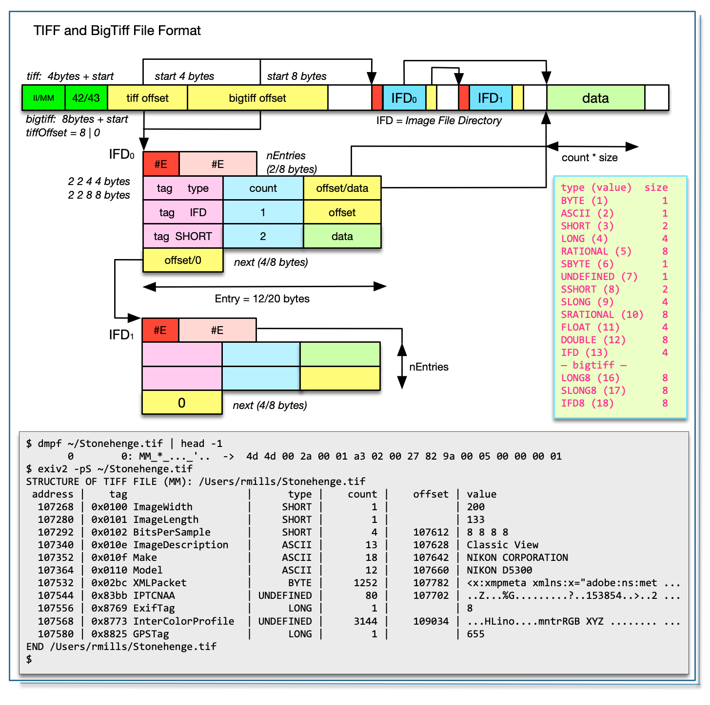
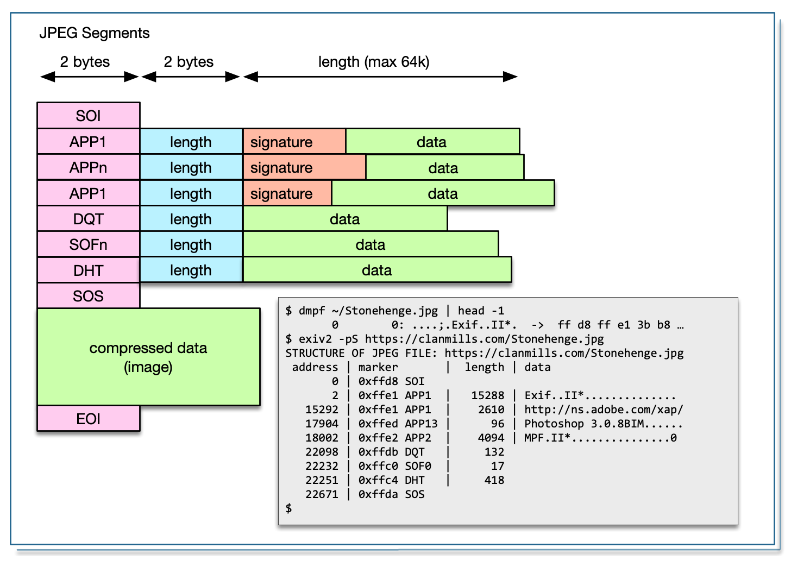
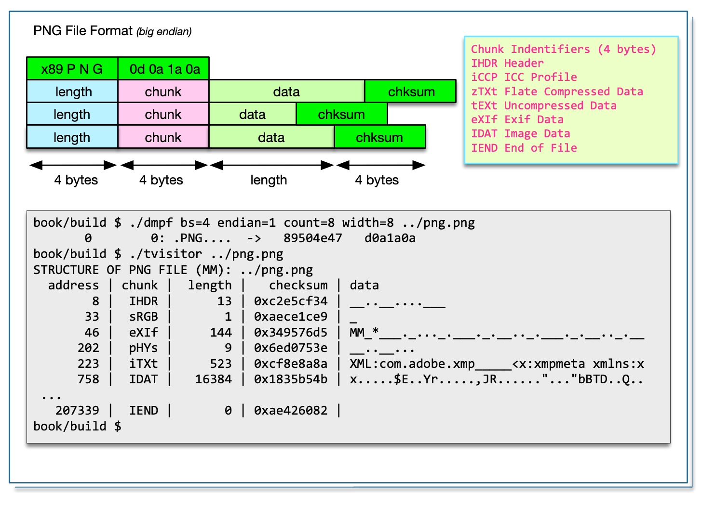
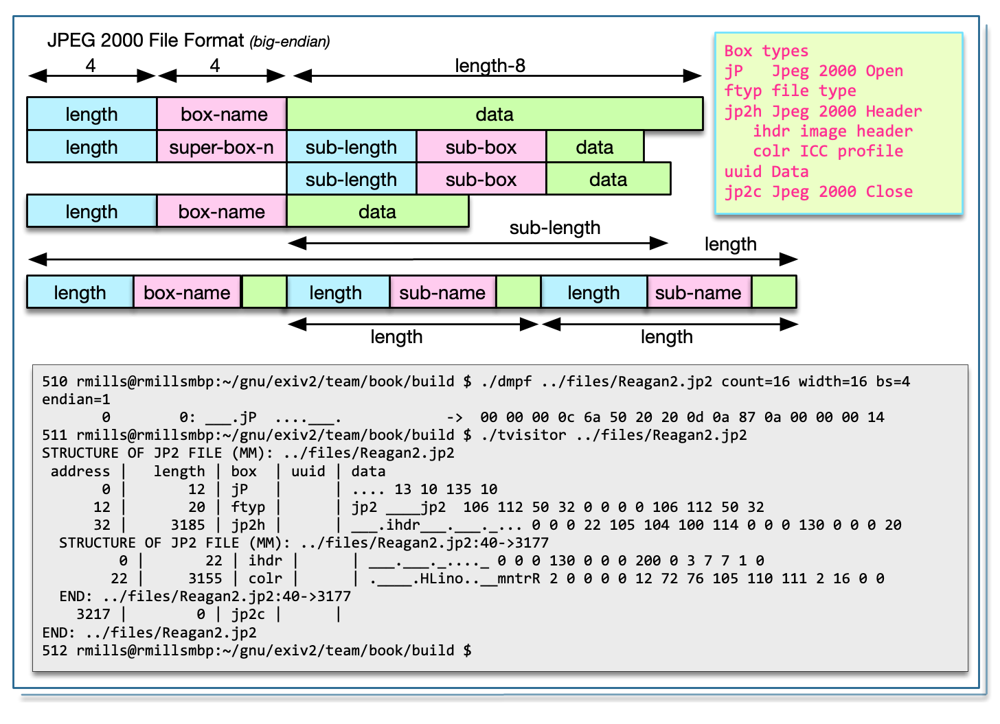
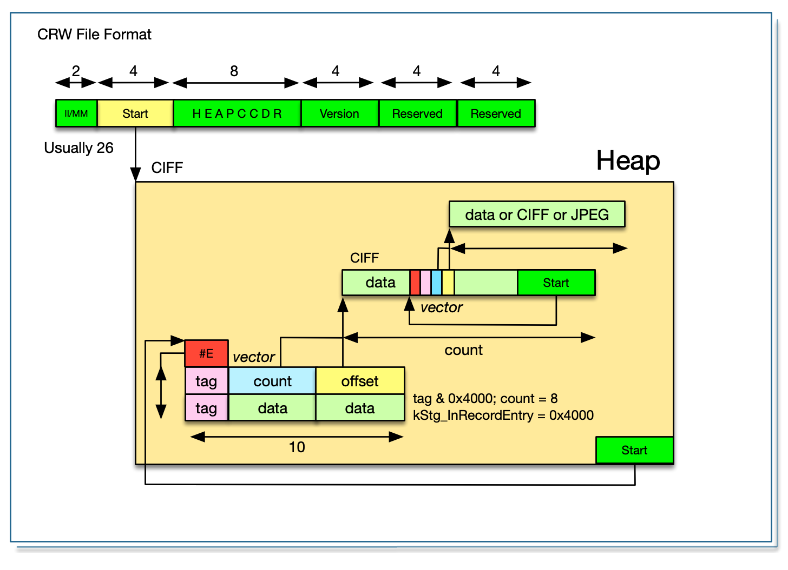
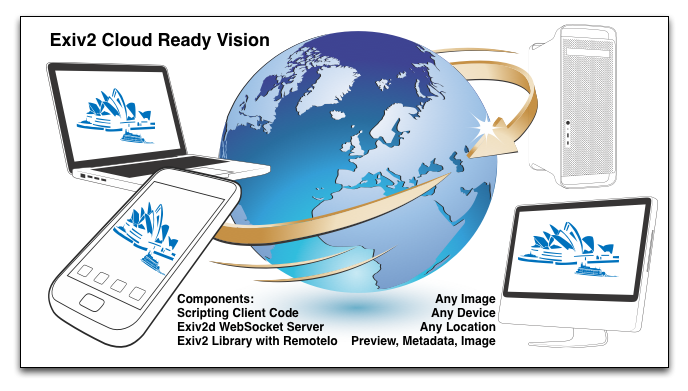

<br><br><br><br>
<center></center>

<h3 align=center style="font-size: 48px;color:#FF4646;font-family: Palatino, Times, serif;"><br>Image Metadata<br><i>and</i><br>Exiv2 Architecture</h3>

<h3 align=center style="font-size:36px;color:#23668F;font-family: Palatino, Times, serif;">Robin Mills<br>2020-07-03</h3>

<div id="dedication">
## _Dedication and Acknowledgment_

_I want to say <b>Thank You</b> to a few folks who have made this possbile._

_First, my wife Alison, who has been my loyal support since the day we met in High School in 1967._

_Secondly, Andreas Huggel the founder of the project and Luis and Dan who have worked tirelessly with me since 2017._

_Exiv2 contributors (in alphabetical order): Abhinav, Alan, Andreas (both of them), Ben, Gilles, Kevin, Mahesh, Michal, Nehal, Neils, Phil, Sridhar, Thomas, Tuan .... and others who have contributed to Exiv2._

_File Detectives:  Phil Harvey, Dave Coffin, Laurent Cl&eacute;vy._

_And our cat Lizzie._

<center></center>

[TOC](#TOC)  

## <center>TABLE of CONTENTS</center>
<div id="TOC">

| Section                                             | Page | Image Formats                       | Page | Project Management                    | Page | 
|:--                                                    | --:|:--                                    | --:|:--                                      | --:|
| [1. Image File Formats](#1)                           |  9 | [TIFF and BigTiff](#TIFF)             | 10 | [13. Project Management](#13)           | 77 |
| [2. Tiff and Exif metadata](#2)                       | 32 | [JPEG and EXV](#JPEG)                 | 12 | [13.1 C++ Code](#13-1)                  | 78 |
| [3. MakerNotes](#3)                                   | 35 | [PNG Portable Network Graphics](#PNG) | 17 | [13.2 Build](#13-2)                     | 79 |
| [4. Other metadata containers](#4)                    | 36 | [JP2 Jpeg 2000](#JP2)                 | 18 | [13.3 Security](#13-3)                  | 80 |
| [5. Lens Recognition](#5)                             | 37 | [CRW Canon Raw](#CRW)                 | 19 | [13.4 Documentation](#13-4)             | 80 |
| [6. Sample Applications](#6)                          | 38 | [CR2 Canon Raw Format 2](#CR2)        | 20 | [13.5 Testing](#13-5)                   | 80 |
| [7. I/O in Exiv2](#7)                                 | 39 | [ISOBMFF, CR3, HEIF, AVI](#ISOBMFF)   | 21 | [13.6 Sample programs](#13-6)           | 80 |
| [8. Exiv2 Architecture](#8)                           | 41 | [WebP Web Photograph ](#WEBP)         | 22 | [13.7 User Support](#13-7)              | 80 |
| [8.1 Extracting metadata using dd](#8-1)              | 41 | [MRW Minolta Raw](#MRW)               | 23 | [13.8 Bug Tracking](#13-8)              | 81 |
| [8.2 Tag Names in Exiv2](#8-2)                        | 42 | [ORF Olympus Raw Format](#ORF)        | 24 | [13.9 Release Engineering](#13-9)       | 81 |
| [8.3 TagInfo](#8-3)                                   | 44 | [PGF Portable Graphics Format](#PGF)  | 25 | [13.10 Platform Support](#13-10)        | 81 |
| [8.4 Visitor Design Pattern](#8-4)                    | 44 | [PSD PhotoShop Document](#PSD)        | 26 | [13.11 Localisation](#13-11)            | 81 |
| [8.5 IFD:accept() and TiffImage::accept() ](#8-5)     | 48 | [RAF](#RAF)                           | 27 | [13.12 Build Server](#13-12)            | 81 |
| [8.6 Presenting data with visitTag()](#8-6)<br>       | 53 | [RW2](#RW2)                           | 28 | [13.13 Source Code Management](#13-13)  | 81 |
| [8.7 Tag Decoder](#8-7)                               | 57 | [TGA](#TGA)                           | 29 | [13.14 Project Web Site](#13-14)        | 81 |
| [8.8 Jpeg::Image accept()](#8-8)                      | 59 | [GIF Graphical Image Format](#GIF)    | 30 | [13.15 Project Servers ](#13-15)        | 81 |
| [9. Image Previews](#9)                               | 61 | [BMP Windows Bitmap](#BMP)            | 31 | [13.16 API Management](#13-16)          | 81 |
| [10. Test Suite and Build](#10)                       | 63 | _**Other Sections**_                  |    | [13.17 Recruiting Contributors](#13-17) | 81 |
| [10.1 Bash Tests](#10-1)                              | 63 | [Dedication](#dedication)             |  2 | [13.18 Project Scheduling](#13-18)      | 82 |
| [10.2 Python Tests](#10-2)                            | 68 | [About this book](#about)             |  4 | [13.19 Enhancement Requests](#13-19)    | 82 |
| [10.3 Unit Tests](#10-3)                              | 69 | [How did I get interested ?](#begin)  |  4 | [13.20 Tools](#13-20)                   | 82 |
| [10.4 Version Test](#10-4)                            | 70 | [2012 - 2017](#2012)                  |  5 | [13.21 Licensing](#13-21)               | 82 |
| [11. API/ABI Compatibility](#11)                      | 71 | [2017 - Present](#2017)               |  5 | [13.22 Back-porting](#13-22)            | 82 |
| [12. Security](#12)                                   | 73 | [Current Priorities](#current)        |  6 | [13.23 Other OSS projects](#13-23)      | 82 |
| [12.1 The Fuzzing Police](#12)                        | 74 | [Future Projects](#future)            |  6 |                                         |    |
| [12.2 How we deal with security issues](12-2)         | 75 | [Scope of Book](#scope)               |  7 |                                         |    |
| [14. Code discussed in this book](#14)                | 80 | [Making this book](#making)           |  8 | [The Last Word](#finally)               | 84 |


<div id="about">
## About this book

This book is about **Image Metadata _and_ Exiv2 Architecture**.

**Image Metadata** is the information stored in a digital image in addition to the image itself.  Data such as the camera model, date, time, location and camera settings are stored.  To my knowledge, no book has been written about this important technology.

**Exiv2 Architecture** is about the Exiv2 library and command-line application which implements cross-platform code in C++ to read, modify, insert and delete items of metadata.  I've been working on this code since 2008 and, as I approach my 70th birthday, would like to document my knowledge in the hope that the code will be maintained and developed by others in future.

At the moment, the book is _**work in progress**_ and expected to be finished by the end of 2020.  Exiv2 v0.27.3 shipped on schedule on 2020-06-30 and I feel the text and the code discussed in this book are good enough to be released in its current state.

[TOC](#TOC)

<div id="begin">
### How did I get interested in this matter?

I first became interested in metadata because of a trail conversation with Dennis Connor in 2008.  Dennis and I ran frequently together in Silicon Valley and Dennis was a Software Development Manager in a company that made GPS systems for Precision Agriculture.  I had a Garmin Forerunner 201 Watch.  We realised that we could extract the GPS data from the watch in GPX format, then merge the position into photos.  Today this is called "GeoTagging" and is supported by many applications.

<center></center>

I said "Oh, it can't be too difficult to do that!".  And here we are more than a decade later still working on the project.  The program geotag.py was completed in about 6 weeks.  Most of the effort went into porting Exiv2 and pyexiv2 to Visual Studio and macOS.  Both Exiv2 and pyexiv2 were Linux only at that time.

The sample application samples/geotag.cpp provides a command line utility to geotag photos and I frequently use this on my own photographs.  Today, I have a Samsung Galaxy Watch which uploads runs to Strava.  I download the GPX from Strava.  The date/time information in the JPG is the key to search for the position data.  The GPS tags are created and saved in the image.

In 2008, I chose to implement this in python to motivate me to learn Python.  Having discovered exiv2 and the python wrapper pyexiv2, I set off with enthusiasm to build a cross-platform script to run on **Windows** _(XP, Visual Studio 2003)_, **Ubuntu Linux** _(Hardy Heron 2008.04 LTS)_ and **macOS** _(32 bit Tiger 10.4 on a big-endian PPC)_.  After I finished, I emailed Andreas.  He responded in less than an hour and invited me to join Team Exiv2.  Initialially, I provided support to build Exiv2 with Visual Studio.

Incidentally, later in 2008, Dennis offered me a contract to port his company's Linux code to Visual Studio to be used on a Windows CE Embedded Controller.  1 million lines of C++ were ported from Linux in 6 weeks.  I worked with Dennis for 4 years on all manner of GPS related software development.

[https://clanmills.com/articles/gpsexiftags/](https://clanmills.com/articles/gpsexiftags/)

I have never been employed to work on Metadata.  I was a Senior Computer Scientist at Adobe for more than 10 years, however I was never involved with XMP or Metadata.

[TOC](#TOC)

<div id="2012">
### 2012 - 2017

By 2012, Andreas was loosing interest in Exiv2.  Like all folks, he has many matters which deserve his time.  A family, a business, biking and other pursuits.  From 2012 until 2017, I supported Exiv2 mostly alone.  I had lots of encouragement from Alan and other occasional contributors.  Neils did great work on lens recognition and compatibility with ExifTool.  Ben helped greatly with WebP support and managed the transition of the code from SVN to GitHub.  Phil _(of ExifTool fame)_ has always been very supportive and helpful.

I must also mention our adventures with Google Summer of Cocde and our students Abhinav, Tuan and Mahesh.  GSoC is a program at Google to sponsor students to contribute to open source projects. 1200 Students from around the world are given a bounty of $5000 to contribute 500 hours to a project during summer recess.  The projects are supervised by a mentor.  Exiv2 is considered to be part of the KDE family of projects.  Within KDE, there a sub-group of Graphics Applications and Technology.  We advertised our projects, the students wrote proposals and some were accepted by Google on the Recommendation of the KDE/Graphics group.

In 2012, Abhinav joined us and contributed the Video read code and was mentored by Andreas.  In 2013, Tuan joined us and contributed the WebReady code and was mentored by me.  Mahesh also joined us to contribute the Video write code and was mentored by Abhinav.

I personally found working with the students to be enjoyable and interesting.  I retired from work in 2014 and returned to England after 15 years in Silicon Valley.  In 2016, Alison and I had a trip round the world and spent a day with Mahesh in Bangalore and with Tuan in Singapore.  We were invited to stay with Andreas and his family.  We subsequently went to Vietnam to attend Tuan's wedding in 2017.

I started working on Exiv2 to implement GeoTagging.  As the years have passed, I've explored most of the code.  I've added new capability such as support for ICC profiles, metadata-piping and file-debugging.  I've done lots of work on the build, test suite and documentation.  I've talked to users all over the world and closed several hundred issues and feature requests.  Over the years, I've met users in India, Singapore, Armenia, the USA and the UK.  I've attended 2 Open-Source Conferences. It's been an adventure and mostly rewarding.  It's remarkable how seldom users express appreciation.

[TOC](#TOC)
<div id="2017">
### 2017 - 2020

After v0.26 was released in 2017, Luis and Dan started making contributions.  They have made many important contributions in the areas of security, test and build.  In 2019, Kevin joined us.  He discovered and fixed some security issues.

The current release of Exiv2 is v0.27.3 and was released on 2020-06-30.  I hope v0.28 will ship in 2020.  Further "dot" releases of v0.27 may be published for security fixes in future.

The Libre Graphics Meeting is scheduled to take place in May 2021 in Rennes, France.  I intend to conduct a workshop on **Image Metadata _and_ Exiv2 Architecture**.  This book is being written to be used in that presentation.

[TOC](#TOC)
<div id="current">
### Current Development Priorities

In July 2017 we received our first security CVE.  Not a pleasant experience.  The security folks started hitting us with fuzzed files. These are files which violate format specifications and can cause the code to crash. We responded with v0.27 which will have regular "dot" releases to provide security fixes.  Managing frequent releases and user correspondence consumes lots of my time.

In parallel with "the dots", major work is being carried to prepare Exiv2 for the future. Dan and Luis are working on v0.28 which will be released in 2020. This is a considerable reworking of the code into C++11.

I'm delighted by the work done by Dan, Luis and Kevin to deal with the assault of the security people. I believe we are responding effectively to security issues. None-the-less, they have dominated the development of Exiv2 for at least two years and many ideas could not be pursued because security consumed our engineering resources.

[TOC](#TOC)
<div id="future">
### Future Development Projects

The code is in good shape, our release process is solid and we have comprehensive user documentation.  As photography develops, there will be many new cameras and more image formats such as CR3, HEIF and BigTiff.   Exiv2 Video support is weak and was deprecated in v0.27.  It will be removed in 0.28.

A long standing project for Exiv2 is a **unified metadata container**.  There is an implementation of this in the SVN repository.  Currently we have three containers for Exif, Iptc and Xmp.  This is clumsy.  We also have a restriction of one image per file.  Perhaps both restrictions have a common solution.

The toolset used in Software Engineering evolves with time.  C++ has been around for about 35 years and, while many complain about it, I expect it will out-live most of us.  None-the-less, languages which are less vulnerable to security issues may lead the project to a re-write in a new language such as Rust.  I hope this book provides the necessary understanding of metadata to support such an undertaking.

The most common issue raised on GitHub concerns lens recognition.  For v0.26, I added the _**Configuration File**_ feature to enable users to modify lens recognition on their computer.  While this is helpful, many users would like Exiv2 to deal with this perfectly, both now and in the future.

I intend to make a proposal at LGM in Rennes in May 2021 concerning this matter. Both exiv2 and ExifTool can extract metadata from an image into a .EXV file. I will propose to implement a program to read the .exv and return the Lens. That program will have an embedded programming language with the rules to identify the lens. The scripts will be ascii files which can be updated. It will be called M2Lscript (MetaData to Lens Script), pronounced _**"MillsScript"**_. The M2Lscript interpreter will be available as a command-line program, a perl module (for ExifTool), a C++ library (for linking into exiv2) and perhaps a python module.

In this way, new lens definitions can be written in M2Lscript without touching anything in Exiv2 or ExifTool.

I will be unable to work on both Exiv2 and M2Lscript simulateously.  When a new maintainer takes responsibility for Exiv2, I will retire.  M2Lscript will be my swansong technology project.

[TOC](#TOC)
<div id="scope">
### Purpose and Scope of this book

This book is my gift and legacy to Exiv2.  I hope Exiv2 will continue to exist long into the future.  This book is being written to document my discoveries about **Image Metadata _and_ Exiv2 Architecture**.  However, I want to avoid a _**cut'n'paste**_ of information already in the project documentation.  This book is an effort to collect my knowledge of this code into a single location.  Many topics in this book are discussed in more detail in the issue history stored in Redmine and GitHub.  I hope this book helps future maintainers to understand Exiv2, solve issues and develop the code for years to come.

I wish you a happy adventure in the world of Image Metadata.  If you'd like to discuss matters concerning this book, please open an issue on GitHub and share your thoughts with Team Exiv2.

This book is copyright and licensed under GNU GPLv2. [https://www.gnu.org/licenses/old-licenses/gpl-2.0.html](https://www.gnu.org/licenses/old-licenses/gpl-2.0.html)

[TOC](#TOC)
<div id="making">
### Making this book

I've had a lot of fun making this book.  Most of the time was spent on the code, however getting the book into good shape for the web and print has been fun.  The graphics were drawn using OmniGraffle 6.6.2 on my MacBook Pro.

All the documentation for Exiv2 is written in markdown with the exception of the Unix man page exiv2.1  I find markdown easy to use and quickly produces satisfying results.  

The book is written in markdown and displayed on my computer with the MacDown Application.  When MacDown exports a PDF, he ignores print directives in the style sheet, he does not support page numbering and the links are ineffective.  To my taste, the text size of pages is too large when printed on A4.

I used a modified version of this style sheet: ~/Library/Application Support/MacDown/Styles/GitHub2.css. I changed the fonts to be Helvetica in the titles and Palatino in the body.  I thought about using the Exiv2 logo font which is Albertus Medium.  I decided to adopt the ubiquitous Palatino.  Code is set in Consolas in both the graphics and the in-line code snippets in the text.

```bash
@media print {
    h1,h2 { page-break-before: always; }
    h3,h4 { page-break-after: never;   }
}
```

I get MacDown to export HTML to IMaEA.html.  I open IMaEA.html in Safari and print it into a PDF file with a page size of 275x389mm.  This preserves the aspect ratio &radic;2/1 of ISO-Standard pages.  Safari has a option to add page number and date to every page.  I get Safari to save the print in PDF (it's 275x388).  The printing system on macOS has a Paper Handling feature to scale the print to fit a page size and I set that to A4.  I save the PDF from the print system and the result is a beautiful A4 document with all the links working and scaled to fit A4.

I have to manually update the page numbers in the table of contents.  If Exiv2 ever supports PDF, I'll probably be able to script that!  I only do that when I intend to publish the file as it's tedious.

The final step is to take the PDF to the local print shop to be printed and bound.

Incidentally, I investigated adding a clickable Exiv2 logo to every page of the PDF and found this very useful open-source program pdfstamp: url = [https://github.com/CrossRef/pdfstamp.git](https://github.com/CrossRef/pdfstamp.git)

PDF documents work in point sizes (72/inch) so A4 pages 297x210mm = 842x596pt.  The origin is in the lower left.

```bash
$ java -jar pdfstamp.jar -v -i ~/gnu/exiv2/team/book/exiv2.png  -l 30,30 -u https://exiv2.org  -pp 2-74 ~/clanmills/exiv2/book/IMaEA.pdf -o .
$ java -jar pdfstamp.jar -v -d 8000 -i ~/gnu/exiv2/team/book/exiv2-large.png  -l 550,30 -u https://exiv2.org  -pp 2-75 ~/clanmills/exiv2/book/IMaEA.pdf -o . 
```

We AAAA could use this to add page labels (date/time/title) to every page (except the cover).

I also investigated doing this in the style-sheet.  I tried Safari, Chrome and Firefox with varying success.  Then I read this: [https://www.smashingmagazine.com/2015/01/designing-for-print-with-css/](https://www.smashingmagazine.com/2015/01/designing-for-print-with-css/).

The prince product fully supports HTML->PDF with @media print in the style sheet and works really well.  They offer a free/unrestricted license for non-commercial use.

[https://www.princexml.com](https://www.princexml.com)

I tried prince and was very pleased with the result.  When you ask prince to create the PDF, you can specify page-size and style sheet.  I've set up IMaEA.css with the builtin page size of 275x389.

```bash
$ prince --page-size='275mm 389mm' --style ~/gnu/exiv2/team/book/pdf-styles.css IMaEA.html
$ prince --type IMaEA.css IMaEA.html
```

The date that appears at the center-bottom of every page (except the first) is in the style sheet. You could change that with sed of course.  Setting the date from the computer clock would be fine for an automatic reporting application.  Better to use static text as we might want to say "Exiv2 v0.27.3 2020-06-30" or the like.

The resulting PDF is beautiful and not watermarked by prince, although they put a postit on the front page.  That's OK.  They deserve credit for their outstanding work and free license.

However, prince rendered the code snippets as plain pre-formatted text and didn't provide the beautiful formatting and syntax colouring provide by MacDown and which is printed in the PDF generated by Safari.

So, I decided that the Safari/PDF was the best PDF and I tweaked the PDF in three ways using SodaPDF.  I fixed the title and dates on every page.  I fixed the "goto page#" PDF links which were mysteriously off by one page, and I added a PDF Table of Contents.  The result is a beautiful document which looks great on the tablet (in HTML or PDF), great on the computer and beautiful when printed.

<center></center>

Thank You for reading my book.  If you find errors, please let me know.  If you'd like to discuss any of the technology involved in Image Metadata, please contact me by opening an issue on GitHub. [https://github.com/exiv2/exiv2](https://github.com/exiv2/exiv2)

[TOC](#TOC)
<div id="1"">
# 1 Image File Formats

The following summaries of the file formats are provided to help you to understand both this book and the Exiv2 code.  The Standard Specifications should be consulted for more detail.

I've made a summary of every file format as I think you'll find that useful.  There are an absurd number of Graphics File Formats.  I have a copy somewhere of the O'Reilly book.  I got it in 1996 and it is 1000+ pages.  Since then there have been many many more invented.  It's a software mess.  In the early days, many formats were local to a few users in a University and escaped to a wider audience.  However the never ending stream of new standards is horrible.  Canon have several different RAW formats such as CRW, CR2 and CR3.

A good model for an image is to think of it as a container.  It's like a directory on the disk.   The directory can hold files with different formats and the directory is recursive as it can contain a directory of more files.  Almost every graphics format since TIFF in 1992 is a container.

The good news however is that file formats come in families which are:

| Family  | Description | Examples |
|:--      |:---         |:--       |
| TIFF    | You must learn Tiff thoroughly to understand metdata                     | TIFF, DNG, NEF,ICC |
| JPG     | The most common format                                                                 | JPEG |
| PNG     | Another popular format<br>Linked list of chunks                                         | PNG |
| Canon   | Popular Canon "Raw" formats.<br>Dave Coffin parse.c decodes                        | CRW, CR2 |
| IsoBMFF | Based on the .mp4 format                                           | MP4, CR3, AVI, HEIF, JP2 |
| RIFF    | Google Promoted Format                                                                 | WEBP |
| Legacy  | These legacy formats<br>usually have no metadata                                   | GIF, BMP |
| IPTC    | Interpress Trade Consortium | Many |
| ICC     | Internation Colour Consortium | Many |
| XMP     | Adobe XMP is written in XML | XMP, sidecar | 
| COS     | Adobe PDF Format<br>Very flexible container                                             | PDF, JDF |
| EPS     | Adobe Encapsulated PostScript<br>The code in Exiv2 to deal with this is deprecated  | EPS, AI |
| PS      | Adobe PostScript<br>The most beautiful graphics language ever invented.                           | PS |

I suspect the software mess is caused by the hardware engineers.  When hardware people start a new project, they copy the CAD files from the last project and proceed from there.  They don't worry about back-porting changes or compatibility.  They think firmware people are stupid and do a terrible job!  We have to live with this.

There is also the issue of patents.  It's unclear if it's legal to read an IsoBMFF file which is used by Apple to store Heif files.  I believe it is legal to read IsoBMFF files.  It's illegal to reverse engineer the H.264 codec which is used to encrypt the image in a HEIF.  Metadata is occasionally compressed (PNG), encrypted (Nikon) or ciphered (Sony).

[TOC](#TOC)
<div id="TIFF">
## Tagged Image File Format


The architecture of TIFF and BigTiff are the same.  BigTiff is 64 bit based.  So most uint16\_t data types become uint32\_t and uint32\_t become uint64\_t.  BigTiff has three additional 8 byte types: Long8, SLong8 and Ifd8.

For both TIFF and BigTiff, the _**magic**_ header is MM (Motorola) for big-endian and II (Intel) for little-endian, followed by a 2-byte integer which must be 42 (ascii \*) for Tiff and 43 (ascii +) for BigTiff.  These markers are very obvious **MM\_+** or **II*\_** when formatted by dmpf.cpp

Both tag and type are uint16\_t in TIFF and BigTiff.

The header for TIFF is 8 bytes.  It is the _**magic**_  header followed by a long offset to the first IFD.   The header for BigTiff is 16 bytes.  It is the _**magic**_  header followed by 2 shorts (which must be 8,0) and a long8 offset to the first IFD.

| Element  | TIFF             | BigTiff              | Element        | TIFF      | BigTiff    |
|:--       |:--               |:--                   |:--             |:--        |:--         |
| Header   | XX*_Offset       | XX+_ 8 0 64bitOffset | Header         | 8 bytes   | 16 bytes   |
| Marker   | **\*** 0x2a = 42 | **\+** 0x2b = 43     | Offset         | uint32\_t | uint64\_t  |
| Tag      | uint16\_t        | uint16\_t            | Entry          | 12 bytes  | 20 bytes   |
| Type     | uint16\_t        | uint16\_t            | Entries **#E** | uint16\_t | uint64\_t  |
| Count    | uint32\_t        | uint64\_t            | Next           | uint32\_t | uint64\_t  | 

It's also important to understand that Endian can change as we descend into the file.  There are images in which there are sub-files whose endian setting is different from the container.

### Garbage Collecting Tiff Files

There is a significant problem with the Tiff format.  It's possible for binary records to hold offsets to significant data elsewhere in the file.  This creates two problems.  Firstly, when buried in an undocumented MakerNote, we don't know that the data is an offset.  So, when all the blocks move in a rewrite of the file, we can neither relocate the referenced data, nor update the offset.  My conclusion is that is almost impossible to garbage collect a tiff file.  However, the situation isn't hopeless.  The offset in the Tiff Header defines the location of IFD0.  It's very common that IFD0 is at the end of the file and the reason is obvious.  When a Tiff is rewritten by an application, they create IFD0 in memory, then copy it to the end of the file and update the offset in the header.  If we are creating IFD0, we can safely reuse the spaced occuped by previous IFD0.

Imperial College have medical imaging Tiff files which are of the order of 100 GigaBytes in length.  Clearly we do not want to rewrite such a file to modify a few bytes of metadata.  We determine the new IFD0 and write it at end of the file. 

When we update a Makernote, we should "edit in place" and always avoid relocating the data.  Regrettably for a JPEG, that's almost impossible.  As camera manufacturers have higher resolutions and larger displays for review, the manufacturers want to have larger thumbnails and are happy to store the preview somewhere in the JPEG and have a hidden offset in the makernote.  This works fine until the image is edited when the preview is lost.

In principle, a Tiff can be garbage collected with a block-map.  If we set up a block-map with one bit for every thousand bytes, we can run the IFDs and mark all the blocks in use.  When we rewrite the TIFF (well IFD0 actually), we can inspect the block-map to determine a "hole" in the file at which to write.  I would not do this.  It's unsafe to over-write anything in a Tiff with the exception of IFD0 and the header offset.  The situation with JPEG is more serious.  It's impossible to rewrite the JPEG in place.

The concept of using a block-map to track known data is used in RemoteIo.  We use a block-map to avoid excessive remote I/O by reading data into a cache.  We never read data twice.  We do not need contiguous memory for the file. This is discussed in [7. I/O in Exiv2](#7)

I would like to express my dismay with the design of most image containers.  There is a much simpler design used by macOS and that is a bundle.  A bundle is a directory of files which includes the file Info.plist.  It appears in the Finder to be a simple entity like a file.  The terminal command _**ditto**_  is provided to copy them.  All programming languages can manipulte files.  The metadata in an image should be a little Tiff or sidecar in a bundle.  In principle, a container such as Tiff is a collection of streams that are both relocatable and never reference external data.  Sadly, TIFF and JPEG make it very easy to break both rules.  The design of JPEG makes it almost impossible to edit anything without relocating all the data.  The situation with video is even more serious as the files are huge.  In the PDF format, the file maintains a directory of objects.  The objects can be safely relocated because objects reference each other by name and not the file offset.

### Metadata that cannot be edited

There are tags in Tiff such as _**ImageWidth**_ which cannot be modified without rewriting the pixels in the image.  Exif protects those tags in the functions **TiffHeader::isImageTag()** and **Cr2Header::isImageTag()**.

### Intrusive and NonIntrusive Editing

Exiv2 has a write method to determine how to rewrite TIFF.  I will have to conduct more research concerning this matter.

[TOC](#TOC)
<div id="JPEG">
## JPEG and EXV Format
<br>


JPEG and EXF are almost the same thing, however most graphics applications will reject EXF because it is not a valid JPEG.  ExifTool also supports EXF.  In tvisitor.cpp, class JpegImage handles both and the only difference is respected in JpegImage::valid():

```cpp
bool JpegImage::valid()
{
    IoSave   restore(io(),0);
    bool     result = false;
    byte     h[2];
    io_.read(h,2);
    if ( h[0] == 0xff && h[1] == 0xd8 ) { // .JPEG
        start_  = 0;
        format_ = "JPEG";
        endian_ = keLittle;
        result  = true;
    } else if  ( h[0] == 0xff && h[1]==0x01 ) { // .EXV
        DataBuf buf(5);
        io_.read(buf);
        if ( buf.is("Exiv2") ) {
            start_ = 7;
            format_ = "EXV";
            endian_ = keLittle;
            result = true;
        }
    }
    return result;
} // JpegImage::valid()
```

And here it is in action:

```bash
.../book/build $ ./tvisitor -pS ~/Stonehenge.jpg 
STRUCTURE OF JPEG FILE (II): /Users/rmills/Stonehenge.jpg
 address |    tag type      count | value
       0 | 0xffd8 SOI  
       2 | 0xffe1 APP1  |   15288 | Exif__II*_.___._..._.___.___..._.___ +++
   15292 | 0xffe1 APP1  |    2610 | http://ns.adobe.com/xap/1.0/_<?xpack +++
   17904 | 0xffed APP13 |      96 | Photoshop 3.0_8BIM.._____'..__._...Z +++
   18002 | 0xffe2 APP2  |    4094 | MPF_II*_.___.__.._.___0100..._.___._ +++
   22098 | 0xffdb DQT   |     132 
   22232 | 0xffc0 SOF0  |      17 
   22251 | 0xffc4 DHT   |     418 
   22671 | 0xffda SOS  
END: /Users/rmills/Stonehenge.jpg
.../book/build $ exiv2 -ea --verbose --force ~/Stonehenge.jpg 
File 1/1: /Users/rmills/Stonehenge.jpg
Writing Exif data from /Users/rmills/Stonehenge.jpg to /Users/rmills/Stonehenge.exv
Writing IPTC data from /Users/rmills/Stonehenge.jpg to /Users/rmills/Stonehenge.exv
Writing XMP data from /Users/rmills/Stonehenge.jpg to /Users/rmills/Stonehenge.exv
.../book/build $ ./tvisitor -pS ~/Stonehenge.exv 
STRUCTURE OF EXV FILE (II): /Users/rmills/Stonehenge.exv
 address |    tag type      count | value
       0 | 0xff01      
       7 | 0xffe1 APP1  |   15296 | Exif__II*_.___._..._.___.___..._.___ +++
   15305 | 0xffe1 APP1  |    2610 | http://ns.adobe.com/xap/1.0/_<?xpack +++
   17917 | 0xffed APP13 |      68 | Photoshop 3.0_8BIM.._____...__._...Z +++
   17987 | 0xffd9 EOI  
END: /Users/rmills/Stonehenge.exv
.../book/build $ 
```

### Extended JPEG

The JPEG standard restricts a single segment of a JPEG to 64k bytes because the length field is a 16 bit uint16_t.  Exif, XMP and ICC frequently exceed 64k.  Regrettably three different schemes are used to enable multiple consecutive segments to be coalesced into a larger block.

tvisitor.cpp supports Adobe and AGFA extended JPEG.

#### Adobe Exif >64k in JPEG

Adobe have created an _**ad-hoc**_ standard by placing consecutive APP1 segments with the signature **Exif\0\0**.  This _**ad-hoc**_ standard is defined in Adobe's XMP Specification Part 3 2016+. 

Exiv2 has no code to deal with this.  It can neither read nor write these files.  In fact, JpegImage::writeMetadata() currently throws when asked to write more than 64k into a JPEG.

This is discussed here: [https://dev.exiv2.org/issues/1232](https://dev.exiv2.org/issues/1232) and here is the output of the test files which were contributed by Phil.

```bash
.../book/build $ ./tvisitor -pS ~/cs4_extended_exif.jpg 
STRUCTURE OF JPEG FILE (II): /Users/rmills/cs4_extended_exif.jpg
 address | marker       |  length | signature
       0 | 0xffd8 SOI  
       2 | 0xffe0 APP0  |      16 | JFIF_..._._.__..
      20 | 0xffe1 APP1  |   65498 | Exif__MM_*___._..._.___.___n.._.___._.__
   65520 | 0xffe1 APP1  |   65498 | Exif__g keys we require'd            nex
  131020 | 0xffe1 APP1  |   52820 | Exif__)            if ($$segDataPt =~ /^
  183842 | 0xffed APP13 |    4440 | Photoshop 3.0_8BIM..____....__.__..x..#-
  188284 | 0xffe1 APP1  |    4323 | http://ns.adobe.com/xap/1.0/_<?xpacket b
  192609 | 0xffe1 APP1  |   65477 | http://ns.adobe.com/xmp/extension/_C8400
  258088 | 0xffe1 APP1  |   65477 | http://ns.adobe.com/xmp/extension/_C8400
  323567 | 0xffe1 APP1  |   56466 | http://ns.adobe.com/xmp/extension/_C8400
  380035 | 0xffe2 APP2  |    3160 | ICC_PROFILE_..__.HLino..__mntrRGB XYZ ..
  383197 | 0xffee APP14 |      14 | Adobe_d.___...
  383213 | 0xffdb DQT   |     132 | _.......................................
  383347 | 0xffc0 SOF0  |      17 | ..T...."_........
  383366 | 0xffdd DRI   |       4 | _...
  383372 | 0xffc4 DHT   |     319 | __........_______._..........._........_
  383693 | 0xffda SOS   |      12 | .._...._?_.T
END: /Users/rmills/cs4_extended_exif.jpg
.../book/build $ ./tvisitor -pS ~/multi-segment_exif.jpg 
STRUCTURE OF JPEG FILE (II): /Users/rmills/multi-segment_exif.jpg
 address | marker       |  length | signature
       0 | 0xffd8 SOI  
       2 | 0xffe1 APP1  |   65535 | Exif__II*_.___._..._.___.___..._.___.___
   65539 | 0xffe1 APP1  |    5603 | Exif__..................................
   71144 | 0xffdb DQT   |     132 | _.......................................
   71278 | 0xffc4 DHT   |     418 | __........________............_.........
   71698 | 0xffc0 SOF0  |      17 | ..0.@..!_........
   71717 | 0xffda SOS   |      12 | .._...._?_..
END: /Users/rmills/multi-segment_exif.jpg
.../book/build $ 
```

#### AGFA Exif >64k in JPEG

This is discussed in [https://dev.exiv2.org/issues/1232](https://dev.exiv2.org/issues/1232)  I think it is desirable to support reading this data.  Exiv2 should write using Adobe's JPEG > 64k _**ad-hoc**_ standard.

```bash
.../book/build $ ./tvisitor -pS ~/Agfa.jpg 
STRUCTURE OF JPEG FILE (II): /Users/rmills/Agfa.jpg
 address | marker       |  length | signature
       0 | 0xffd8 SOI  
       2 | 0xffe1 APP1  |   46459 | Exif__II*_.___._..._.___.___..._.___.___..._._
   46463 | 0xffe3 APP3  |   65535 | ...._._.......................................
  112000 | 0xffe4 APP4  |   65535 | ..Hc..w .8<...z..M.77.h...{......C.y1...... .k
  177537 | 0xffe5 APP5  |    7243 | .U......K..u=).pl.W.F...B.$.3....mg}q.....Hb.m
  184782 | 0xffdb DQT   |     132 | 
  184916 | 0xffc0 SOF0  |      17 | 
  184935 | 0xffc4 DHT   |      75 | 
  185012 | 0xffda SOS   |      12 | 
END: /Users/rmills/Agfa.jpg
.../book/build $ 
```

The Agfa MakerNote contains an IFD which is preceded by **ABC_II#E** where #E is number of entries in the IFD.  This is discussed in [3 MakerNotes](#3)

#### ICC Profile data > 64k in JPEG

This is documented by ICC and implemented in Exiv2 for both reading and writing.  tvisitor.cpp does not support ICC Profiles.

#### XMP data > 64k in JPEG

This is documented by Adobe in the XMP Specification 2016+ and implemented in Exiv2 in the API **JpegBase::printStructure::(kpsXMP)**.  It is not implemented in **JpegBase::readMetadata()**.


### Other Unusual Adobe JPEG Features

Adobe have implemented transparency in JPEG by storing a PostScript clippath in the APP13 Photoshop 3.0 segment.  Exiv2 has no code to deal with this. There is an Exif tag ClipPath which Exiv2 does support.  I have encountered PhotoShop APP13 transparency.  I've never encountered Exif.Image.ClipPath.

[TOC](#TOC)
<div id="PNG">
## PNG Portable Network Graphics


PNG is always bigEndian encoded.   PNG has an 8 byte fixed header followed by a linked list of chunks.  A chunk is 12 or more bytes and has a uint32\_t length, char[4] chunk identifier, followed by binary data. The chunk data is trailed by a uint32\_t checksum calculated by the zlib compression library.

We validate a PNG with the following code:

```cpp
bool PngImage::valid()
{
    IoSave   restore(io(),0);
    bool     result  = true ;
    const byte pngHeader[] = { 0x89, 0x50, 0x4E, 0x47, 0x0D, 0x0A, 0x1A, 0x0A };
    for ( size_t i = 0 ; result && i < sizeof (pngHeader ); i ++) {
        result = io().getb() == pngHeader[i];
    }
    if ( result ) {
        start_  = 8       ;
        endian_ = keBig   ;
        format_ = "PNG"   ;
    }
    return result;
}
```

Navigating a PNG is straight forward:

```cpp
void PngImage::accept(class Visitor& v)
{
    if ( valid() ) {
        v.visitBegin(*this);
        IoSave restore(io(),start_);
        uint64_t address = start_ ;
        while (  address < io().size() ) {
            io().seek(address );
            uint32_t  length  = io().getLong(endian_);
            uint64_t  next    = address + length + 12;
            char      chunk  [5] ;
            io().read(chunk  ,4) ;
            chunk[4]        = 0  ; // nul byte
           
            io().seek(next-4);                            // jump over data to checksum
            uint32_t  chksum  = io().getLong(endian_);
            v.visitChunk(io(),*this,address,chunk,length,chksum); // tell the visitor
            address = next ;
        }
        v.visitEnd(*this);
    }
}
```

Reporting Exif and XMP is also easy.

```cpp
void Visitor::visitChunk(Io& io,Image& image
                        ,uint64_t address,char* chunk,uint32_t length,uint32_t chksum)
{
    IoSave save(io,address+8);
    DataBuf   data(length);
    io.read(data);

    if ( option() & (kpsBasic | kpsRecursive) ) {
        out() << stringFormat(" %8d |  %s | %7d | %#10x | ",address,chunk,length,chksum);
        if ( length > 40 ) length = 40;
        out() << data.toString(kttUndefined,length,image.endian()) << std::endl;
    }

    if ( option() & kpsRecursive && std::strcmp(chunk,"eXIf") == 0 ) {
        Io        tiff(io,address+8,length);
        TiffImage(tiff).accept(*this);
    }

    if ( option() & kpsXMP && std::strcmp(chunk,"iTXt")==0 ) {
        if ( data.strcmp("XML:com.adobe.xmp")==0 ) {
            out() << data.pData_+22 ;
        }
    }
}
```

### PNG and the Zlib compression library

PNG usually compresses chunked data using Flate (lossless) compression.  For simplicity tvisitor.cpp does does not link zlib and therefore cannot decompress these chunks.  tvisitor.cpp is unable to verify that the checksums are correct.  Exiv2 is normally linked by with zlib and can perform those tasks.  I recommend that you read the Exiv2 library code if you want to learn about using zlib and metadata.

I'm very pleased to say that neither the Exiv2 or XMP metdata in the image book/png.png have been compressed and can be easily reported by tvisitor.cpp.  It's very satisfying to  use images from this book as test data for the code in this book.

[TOC](#TOC)
<div id="JP2">
## JP2 JPEG 2000


JP2 is always big-endian encoded.

The JPEG 2000 file is an ISOBMFF Container.  It consists of a linked lists of "boxes" which have a uint32\_t length, char[4] box-type and length-8 bytes of data.  A box may be a "super-box" and be a container for other boxes.

I believe the "box" idea in ISOBMFF is intended to address the issue I discussed about TIFF files.  In order to rewrite an image, it is necessary for the data to be self contained and relocatable.  Every "box" should be self contained with no offsets outside the box.  My study of JP2 is restricted to finding the Exiv2, ICC, IPTC and XMP data.  For sure these are self-contained blocks of binary data.  The metadata boxes are of type uuid and begin with a 128bit/16 byte UUID to identify the data.

In a JP2 the first box, must be box-type of "jP\_\_" and have a length of 12.  The chain is terminated with a box-type of "jpcl".  Usually the terminal block with bring you to the end-of-file, however this should not be assumed as there can be garbage following the box chain.  The box chain of a super-box is normally terminated by reaching the end of its data.

Validating a JP2 file is straight forward:

```cpp
bool Jp2Image::valid()
{
    if ( !valid_ ) {
        start_ = 0;
        IoSave     restore (io(),start_);
        uint32_t   length = io().getLong(endian_);
        uint32_t   box    ;
        io().read(&box,4);
        valid_ = length == 12 && boxName(box) == kJp2Box_jP;
    }
    return valid_ ;
}
```

The accept function is also straight forward:

```cpp
void Jp2Image::accept(class Visitor& v)
{
    if ( valid() ) {
        v.visitBegin(*this);
        IoSave restore(io(),start_);
        uint64_t address = start_ ;
        while (  address < io().size() ) {
            io().seek(address );
            uint32_t  length  = io().getLong(endian_);
            uint32_t  box     ;
            io().read(&box,4);
            v.visitBox(io(),*this,address,box,length); // tell the visitor
            // recursion if superbox
            if ( superBox(box) ) {
                uint64_t  subA = io().tell() ;
                Jp2Image jp2(io(),subA,length-8);
                jp2.valid_ = true ;
                jp2.accept(v);
            }
            address = boxName(box) == kJp2Box_jp2c ? io().size() : address + length ;
        }
        v.visitEnd(*this);
    }
}
```

There is a little complication when you create the recursive Jp2Image.  We do not wish to validate this because it never starts with box-type of "jP\_\_".  We know the file is valid, so we set the valid_ flag before the recursion.

The function ReportVisitor::visitBox() is also straight forward:

```cpp
void ReportVisitor::visitBox(Io& io,Image& image,uint64_t address
                            ,uint32_t box,uint32_t length)
{
    IoSave save(io,address+8);
    length -= 8              ;
    DataBuf   data(length);
    io.read(data);
    
    std::string name = image.boxName (box);
    std::string uuid = image.uuidName(data);

    if ( option() & (kpsBasic | kpsRecursive) ) {
        out() << indent() << stringFormat("%8d |  %7d | %#10x %4s | %s | ",address,length,box,name.c_str(),uuid.c_str() );
        if ( length > 40 ) length = 40;
        out() << data.toString(kttUndefined,length,image.endian()) << std::endl;
    }
    if ( option() & kpsRecursive && uuid == "exif" ) {
        Io        tiff(io,address+8+16,data.size_-16); // uuid is 16 bytes (128 bits)
        TiffImage(tiff).accept(*this);
    }
    if ( option() & kpsXMP && uuid == "xmp " ) {
        out() << data.pData_+17 ;
    }
}
```

Although the JP2 file is big endian, the embedded Exif metadata may be be little-endian encoded.  That's the case with test file Reagan.jp2.

```bash
907 rmills@rmillsmm-local:~/gnu/exiv2/team/book/build $ ./tvisitor -pR ../test/data/Reagan.jp2 
STRUCTURE OF JP2 FILE (MM): ../test/data/Reagan.jp2
 address |   length | box             | uuid | data
       0 |        4 | 0x2020506a jP   |      | ....
      12 |       12 | 0x70797466 ftyp |      | jp2 ____jp2 
      32 |       37 | 0x6832706a jp2h |      | ___.ihdr___.___._..._____.colr._____.
  STRUCTURE OF JP2 FILE (MM): ../test/data/Reagan.jp2:40->37
   address |   length | box             | uuid | data
         0 |       14 | 0x72646869 ihdr |      | ___.___._...__
        22 |        7 | 0x726c6f63 colr |      | ._____.
  END: ../test/data/Reagan.jp2:40->37
      77 |     1334 | 0x64697575 uuid | exif | JpgTiffExif->JP2II*_.___._..._..__.___..
  STRUCTURE OF TIFF FILE (II): ../test/data/Reagan.jp2:101->1318
   address |    tag                              |      type |    count |    offset | value
        10 | 0x010e Exif.Image.ImageDescription  |     ASCII |      403 |       170 | 040621-N-6536T-062
        22 | 0x010f Exif.Image.Make              |     ASCII |       18 |       574 | NIKON CORPORATION
...
       142 | 0x8769 Exif.Image.ExifTag           |      LONG |        1 |           | 2191130661
    STRUCTURE OF TIFF FILE (II): ../test/data/Reagan.jp2:101->1318
     address |    tag                              |      type |    count |    offset | value
         714 | 0x829a Exif.Photo.ExposureTime      |  RATIONAL |        1 |      1162 | 1/125
...
        1122 | 0xa40a Exif.Photo.Sharpness         |     SHORT |        1 |           | 0
    END: ../test/data/Reagan.jp2:101->1318
    STRUCTURE OF TIFF FILE (II): ../test/data/Reagan.jp2:101->1318
     address |    tag                              |      type |    count |    offset | value
        1302 | 000000 Exif.GPSInfo.GPSVersionID    |     UBYTE |        4 |           | 122 97 98 101
    END: ../test/data/Reagan.jp2:101->1318
  END: ../test/data/Reagan.jp2:101->1318
    1419 |      934 | 0x64697575 uuid | iptc | 3.....G#.......8..__._...._.040621-N-653
    2361 |     5582 | 0x64697575 uuid | xmp  | .z....B..q......<?xpacket begin="..." id
    7951 |    32650 | 0x6332706a jp2c |      | .O.Q_/_____.___.___________.___.________
END: ../test/data/Reagan.jp2
908 rmills@rmillsmm-local:~/gnu/exiv2/team/book/build $ 
```

[TOC](#TOC)
<div id="CRW">
## CRW Canon Raw Format



The specification is here: [CIFFspecV1R04.pdf](https://web.archive.org/web/20081230095207/http://xyrion.org/ciff/CIFFspecV1R04.pdf)

[TOC](#TOC)
<div id="CR2">
## CR2 Canon Raw Format 2

To be written.

[TOC](#TOC)
<div id="ISOBMFF">
## ISOBMFF, CR3, HEIF, AVI

I obtained the standard here: [https://mpeg.chiariglione.org/standards/mpeg-4/iso-base-media-file-format/text-isoiec-14496-12-5th-edition](https://mpeg.chiariglione.org/standards/mpeg-4/iso-base-media-file-format/text-isoiec-14496-12-5th-edition)

There has been a lot of discussion in Team Exiv2 concerning the legality of reading this file.  I don't believe it's illegal to read metadata from a container.  I believe it's illegal to decode the H.264 encoder which is used to store the image in Heif.  However the metadata is not protected in anyway.  So, I'll implement this in tvisitor.cpp.  Team Exiv2 may agree to include this in Exiv2 v0.28.  If I every work on Exiv2 v0.27.4, I will implement ISOBMFF support.


[TOC](#TOC)
<div id="WEBP">
## WEBP Web Photograph


[TOC](#TOC)
<div id="MWR">
## MRW Minolta Raw Format

To be written.

[TOC](#TOC)
<div id="ORF">
## ORF Olympus Raw Format

To be written.

[TOC](#TOC)
<div id="PGF">
## PGF Portable Graphics Format

To be written.

[TOC](#TOC)
<div id="1-16">
## PSD PhotoShop

To be written.

<div id="RAF">
## RAF

To be written.

[TOC](#TOC)
<div id="RW2">
## RW2

To be written.

[TOC](#TOC)
<div id="TGA">
## TGA

To be written.

[TOC](#TOC)
<div id="BMP">
## BMP Windows Bitmap

To be written.

[TOC](#TOC)
<div id="GIF">
## GIF Graphics Image Format

To be written.

[TOC](#TOC)
<div id="2">
# 2 Tiff and Exif metadata


Before we get into the Exiv2 code, let's look at the simpler python TIFF/Exif library.   [https://github.com/Moustikitos/tyf](https://github.com/Moustikitos/tyf)

You will also need to install PIL:

```bash
$ sudo python3 -m pip install Pillow
$ git clone https://github.com/Moustikitos/tyf
$ cd tyf
$ sudo python3 setup.py install
```

This is a library and I've constructed a program to reveal the Exif metadata.

```python
#!/usr/bin/env python3

import Tyf
import os
import sys

import urllib.request
from io  import BytesIO
from PIL import Image

##
#
def dumpTags(ifd):
    bDumpTags    = True
    bGenerateMap = False

    if bDumpTags:
        for tag in ifd:
            V=tag[1]
            v=str(V)
            if type(V)==type(''):
                v='"'+v+'"'
            if len(v) > 30:
               v = v[0:26] + '.. '
            t=str(type(V))
            t=t[8:len(t)-2]
            if t == 'bytes':
                t=str(len(V)) + ' ' + t
            elif t == 'str':
                t=str(len(V))
            if len(t) > 30:
                t = t[0:26]+'.. '
                
            t='('+t+')'

            print('%s -> %s %s' % ( tag[0], v , t)  )

##
#
def main(argv):
    """main - main program of course"""

    image = Tyf.open(argv[1])
    # help(jpg)

    if str(type(image)) == "<class 'Tyf.TiffFile'>":
        dumpTags(image[0])
    elif str(type(image)) == "<class 'Tyf.JpegFile'>":
        dumpTags(image.ifd0)
    else:
        print("unknown image type " + str(type(image)))

if __name__ == '__main__':
    main(sys.argv)

# That's all Folks
##
```

Download from [https://clanmills.com/Stonehenge.jpg](https://clanmills.com/Stonehenge.jpg) and [https://clanmills.com/Stonehenge.tif](https://clanmills.com/Stonehenge.tif)

```bash
$ ~/bin/mdump.py  ~/Stonehenge.jpg           $ ~/bin/mdump.py  ~/Stonehenge.tif
Make -> "NIKON CORPORATION" (17)             ImageLength -> 1 (int)
Model -> "NIKON D5300" (11)                  BitsPerSample -> (8, 8, 8, 8) 
Orientation -> 1 (int)                       Compression -> 1 (int)
XResolution -> 300.0 (float)                 PhotometricInterpretation -> 2
YResolution -> 300.0 (float)                 FillOrder -> 1 (int)
ResolutionUnit -> 2 (int)                    ImageDescription -> "Classic V"
Software -> "Ver.1.00 " (9)                  Make -> "NIKON CORPORATION" (1
DateTime -> 2015-07-16 20:25:28 (datetim     Model -> "NIKON D5300" (11)
YCbCrPositioning -> 1 (int)                  StripOffsets -> 901 (int)
Exif IFD -> 222 (int)                        Orientation -> 1 (int)
...
MakerNote -> b'Nikon\x00\x02\x11\x00\x00'    ExposureTime -> 0.0025 (float)
UserComment ->                               FNumber -> 10.0 (float)
SubsecTime -> "00" (2)                       ExposureProgram -> 0 (int)
SubsecTimeOriginal -> "00" (2)               ISOSpeedRatings -> 200 (int)
SubsecTimeDigitized -> "00" (2)              ExifVersion -> b'0230' (4 byte
FlashpixVersion -> b'0100' (4 bytes)         DateTimeOriginal -> 2015-07-16
ColorSpace -> 1 (int)                        DateTimeDigitized -> 2015-07-1
PixelXDimension -> 6000 (int)                ComponentsConfiguration -> 
PixelYDimension -> 4000 (int)                CompressedBitsPerPixel -> 2.0 
Interoperability IFD -> 4306 (int)           ExposureBiasValue -> (0, 1) (t
SensingMethod -> 2 (int)                     MaxApertureValue -> 4.3 (float
FileSource -> b'\x03' (1 bytes)              MeteringMode -> 5 (int)
SceneType -> b'\x01' (1 bytes)               LightSource -> 0 (int)
CFAPattern -> b'\x02\x00\x02\x00\x00\x01'     Flash -> 16 (int)
CustomRendered -> 0 (int)                    FocalLength -> 44.0 (float)
ExposureMode -> 0 (int)                      UserComment -> 
...
GPSLatitudeRef -> 1 (int)                    WhiteBalance -> 0 (int)
GPSLatitude -> 51.17828166666666 (float)     DigitalZoomRatio -> 1.0 (float
GPSLongitudeRef -> -1 (int)                  FocalLengthIn35mmFilm -> 66 (i
GPSLongitude -> 1.8266399999999998 (floa     SceneCaptureType -> 0 (int)
GPSAltitudeRef -> -1 (int)                   GainControl -> 0 (int)
GPSAltitude -> 97.0 (float)                  Contrast -> 0 (int)
GPSTimeStamp -> 14:38:55 (datetime.time)     Saturation -> 0 (int)
GPSSatellites -> "09" (2)                    Sharpness -> 0 (int)
GPSMapDatum -> "WGS-84          " (16)       SubjectDistanceRange -> 0 (int
GPSDateStamp -> 2015-07-16 00:00:00 (dat     ImageUniqueID -> "090caaf..."
                                             GPSLatitudeRef -> 1 (int)
...                                             GPSLatitude -> 51.178280555555
```

Data's similar.  The order is different.  Good news is that the commands _**$ exiv2 -pe ~/Stonehenge.jpg**_ and __*$ exiv2 -pe ~/Stonehenge.tif*__ produce similar data in the same order.  We'd hope so as both commands are reading the same embedded Exif metadata.  The way in which the Exif is embedded in Tiff and JPG is different, however the Exif metadata is effectively the same.

[TOC](#TOC)
<div id="3">
# 3 MakerNotes

https://exiv2.org/makernote.html

MakerNotes are usually written as an IFD, however most manufacturers have a few bytes the precede the IFD.  I suspect this is to store version information.  The code in tvisitor.cpp to handle the makernotes is:

```cpp
void IFD::visitMakerNote(Visitor& visitor,DataBuf& buf,uint16_t count,uint32_t offset)
{
    if ( image_.maker_ == kNikon ) {
        // Nikon MakerNote is embeded tiff `II*_....` 10 bytes into the data!
        size_t punt = buf.strequals("Nikon") ? 10
                    : 0
                    ;
        Io     io(io_,offset+punt,count-punt);
        TiffImage makerNote(io,image_.maker_);
        makerNote.visit(visitor,makerDict());
    } else if ( image_.maker_ == kAgfa && buf.strequals("ABC") ) {
        // Agfa  MakerNote is an IFD `ABC_II#E...`  6 bytes into the data!
        ImageEndianSaver save(image_,keLittle);
        IFD makerNote(image_,offset+6,false);
        makerNote.visit(visitor,makerDict());
    } else {
        bool   bNext = maker()  != kSony;                                        // Sony no trailing next
        size_t punt  = maker()  == kSony && buf.strequals("SONY DSC ") ? 12 : 0; // Sony 12 byte punt
        IFD makerNote(image_,offset+punt,bNext);
        makerNote.visit(visitor,makerDict());
    }
} // visitMakerNote
```

I will write more about this subject later.

[TOC](#TOC)
<div id="4">
# 4 Other metadata containers

Exif is the most important of the metadata containers.  However others exist and are supported by Exiv2:

| Type | Definition | Comment |
|:---  |:----       |:------  |
| EXIF | EXchangeable Image Format | Japanese Electronic Industry Development Association Standard |
| IPTC | International Press Telecommunications Council  | Press Industry Standard |
| Xmp  | Extensible Metadata Platform | Adobe Standard |
| ICC  | International Color Consortium | Industry Consortium for Color Handling Standards |
| ImageMagick/PNG | Portable Network Graphics | Not implemented in Exiv2 |

[TOC](#TOC)
<div id="5">
# 5 Lens Recognition

[TOC](#TOC)
<div id="6">
# 6 Sample Applications

Exiv2 has sample applications which have their own documentation: [README-SAMPLES.md](README-SAMPLES.html).  In Exiv2 v0.27.3, there are 17 samples applications and 19 test programs.  The test programs are intended for use by the test suite and are not installed on the user's computer.

The following programs are built and installed in /usr/local/bin.

| Name | Purpose |
|:---  |:---     |
| _**addmoddel**_   | Demonstrates Exiv2 library APIs to add, modify or delete metadata          |
| _**exifcomment**_ | Set Exif.Photo.UserComment in an image                                     |
| _**exifdata**_    | Prints _**Exif**_ metadata in different formats in an image                |
| _**exifprint**_   | Print _**Exif**_ metadata in images<br>Miscelleous other features          |
| _**exifvalue**_   | Prints the value of a single _**Exif**_ tag in a file                      |
| _**exiv2**_       | Command line utility to read, write, delete and modify Exif, IPTC, XMP and ICC image metadata.<br>This is the primary test tool used by Team Exiv2 and can exercise almost all code in the library.  Due to the extensive capability of this utility, the APIs used are usually less obvious for casual code inspection. | 
| _**exiv2json**_   | Extracts data from image in JSON format.<br>This program also contains a parser to recursively parse Xmp metadata into vectors and objects. | 
| _**geotag**_      | Reads GPX data and updates images with GPS Tags                            |
| _**iptceasy**_    | Demonstrates read, set or modify IPTC metadata                             |
| _**iptcprint**_   | Demonstrates Exiv2 library APIs to print Iptc data                         |
| _**metacopy**_    | Demonstrates copying metadata from one image to another                    |
| _**mrwthumb**_    | Sample program to extract a Minolta thumbnail from the makernote           |
| _**taglist**_     | Print a simple comma separated list of tags defined in Exiv2               |
| _**xmpdump**_     | Sample program to dump the XMP packet of an image                          |
| _**xmpparse**_    | Read an XMP packet from a file, parse it and print all (known) properties. |
| _**xmpprint**_    | Read an XMP from a file, parse it and print all (known) properties..       |
| _**xmpsample**_   | Demonstrates Exiv2 library high level XMP classes                          |

Most of the programs are about 100 lines of C++ and do simple tasks to demonstrate how to use the library API.  Three of the programs are substantial. They are: _**exiv2**_, _**geotag**_ and _**exiv2json**_

The Exiv2 command-line program _**exiv2**_ enables users to manipulate metadata in images using most of the features of the library.  Being a general utility, it has about 4000 lines of code. The length of the program proves the point that it is full featured, however the quantity of code rather obscures the use of the library APIs.

Exiv2 has always resisted the temptation to provide a GUI version of the program as that would involve considerable cross-platform development and user interface skills.  As Andreas Huggel summarised: _Exiv2 does depth, not breadth_.  Providing a GUI would lead the project away from metadata into the world of the _User Experience_.

[TOC](#TOC)
<div id="7">
# 7 I/O in Exiv2

I/O in Exiv2 is achieved using the class BasicIo and derived classes which are:

| _Name_ | _Purpose_ | _Description_ |
|:--     |:--        |:-- |
| BasicIo | Abstract | Defines methods such as open(), read(), seek() and others |
| FileIo  | FILE*    | Operates on a FILE or memory-mapped file |
| MemIo   | DataBuf_t | Operates on a memory buffer |
| RemoteIo | Abstract | provides support for url parsing |
| HttpIo   | http:  | Simple http 1.1 non-chunked support |
| FtpIo    | ftp:,ftps: | Requires CurlIo |
| CurlIo   | http:,https: | Comprehensive remote I/O support |
| SshIo    | server:path | Requires libssh |
| StdinIo    | - | Read from std-in |
| Base64Io   | data:..... | Decodes ascii encoded binary |

You will find a simplified version of BasicIo in tvisitor.cpp in the code that accompanies this book.  Io has several constructors.  The obvious one is **Io(std::string)** which calls **fopen()**.  More subtle is **Io(io,from,size)** which creates a sub-file on an existing stream.  This design deals with embedded files.  Most metadata is written in a format designated by the standards body and embedded in the file.  For example, Exif metadata data is written in Tiff Format and embedded in the file.

The constructor **Io(DataBuf&)** is used to create an in-memory I/O stream.  _**DataBuf**_ has a **read()** method to binary copy from a stream into memory.  As we will see, some subfiles are not contiguous in the image and "chunked" by the image format.  For example, JPEG is always chunked into segments of 64k or less.  When a subfile has been chunked it is convenient to copy bytes into a buffer from which we can create an Io source.

Other metadata standards use a similar design.  XMP is embedded XML, an Icc Profile is a major block of technology.  Exiv2 knows how to extract, insert, delete and replace an Icc Profile.  It knows nothing about the contents of the Icc Profile.  With Xmp, Exiv2 uses Adobe's XMPsdk to enable the the Xmp data to be modified.

Exiv2 has an abstract RemoteIo object which can read/write on the internet.  For http, there is a basic implementation of the http protocol in src/http.cpp.  For production use, Exiv2 should be linked with libcurl.  The reason for providing a "no thrills" implementation of http was two fold.  Firstly, it enabled the project to proceed rapidly without learning the curl API.  Secondly, I wanted all versions of the exiv2 command-line to have http support as I thought it would be useful for testing as we could store video and other large files remotely.

The MemIo class enables memory to be used as a stream.  This is fast and convenient for small temporary files.  When memory mapped files are available, FileIo uses that in preference to FILE*.  When the project started in 2004, memory-mapped files were not provided on some legacy platforms such as DOS.  Today, all operating systems provide memory mapped files.  I've never heard of Exiv2 being used in an embedded controller, however I'm confident that this is feasible.  I've worked on embedded controllers with no operating system and only a standard "C" io library.  Exiv2 can be built for such a device.

Most camera manufacturers are large corporations.  I'm sure they have their own firmware to handle Exif metadata.  However, the world of photography has an ever growing band of start-ups making amazing devices such as Go-Pro.  One day I'll hear that somebody is cycling around on top of Mt Everest with Exiv2 running on top of their head!  One of our users is an astronomer at NASA.  I've never heard that Exiv2 has flown in space, however one day it might.  I will say with pride that Exiv2 is out of this world!

### Using memory mapped files

When available, Exiv2 uses memory mapped files.  This is not a good idea for several reasons.  Firstly, image editing applications can sit for days with a file open. For example, a GIMP user may open a file on Monday and it may be still be open several days later.  In the meanwhile things have changed on the network.  Secondly, memory mapped files on Windows are locked by the operating system.  This causes problems with the virus checker.  Thirdly, it's possible for another application to modify a file which is memory mapped.  Exiv2 has copied the metadata into memory and can have stale/obsolete data.

The reason for using memory mapped files was for the convenience of converting offsets into memory addresses.  Imperial College have 90GByte Tiffs from medical imaging products.  We have to map 90GBytes.  And it gets worse, some file handlers allocate and copy the file before processing.  As we can see in tvisitor.cpp, it's possible to navigate the metadata in huge files with very little I/O.  Memory Mapped files for metadata processing have turned out to have sad consequences.

### Writing Files

Exiv2 is very reliable at writing files which conform to standards.  Andreas has done a wonderful job to ensure that we never damage or corrupt a file.  I believe he uses a "double blind" technique to write the file in memory and verify it before updating the file on disk.  More research is required into this important subject.

[TOC](#TOC)
<div id="8">
# 8 Exiv2 Architecture

<div id="8-1">
### 8.1 Extracting metadata using dd

The exiv2 option _**-pS**_ prints the structure of an image.

```bash
$ exiv2 -pS ~/Stonehenge.jpg 
STRUCTURE OF JPEG FILE: /Users/rmills/Stonehenge.jpg
 address | marker       |  length | data
       0 | 0xffd8 SOI  
       2 | 0xffe1 APP1  |   15288 | Exif..II*......................
   15292 | 0xffe1 APP1  |    2610 | http://ns.adobe.com/xap/1.0/.<?x
   17904 | 0xffed APP13 |      96 | Photoshop 3.0.8BIM.......'.....
   18002 | 0xffe2 APP2  |    4094 | MPF.II*...............0100.....
   22098 | 0xffdb DQT   |     132 
   22232 | 0xffc0 SOF0  |      17 
   22251 | 0xffc4 DHT   |     418 
   22671 | 0xffda SOS  
$
```

We can see that the Exif metadata is stored at offset=2+2+2+6 and has length 15288-offset.  We can extract that as follows:

```bash
$ dd if=~/Stonehenge.jpg count=$((15288-(2+2+2+6))) bs=1 skip=$((2+2+2+6)) > foo.tif
15276+0 records in
15276+0 records out
15276 bytes transferred in 0.102577 secs (148922 bytes/sec)
$ dd if=~/Stonehenge.jpg count=$((15288-(2+2+2+6))) bs=1 skip=$((2+2+2+6)) | dmpf - | head -1
       0        0: II*_.___._..._.___.___..._.___._  ->  49 49 2a 00 08 00 ...
915 rmills@rmillsmbp:~/gnu/exiv2/team/book $ 
$ file foo.tif
foo.tif: TIFF image data, little-endian, direntries=11, manufacturer=NIKON CORPORATION, model=NIKON D5300, orientation=upper-left, xresolution=176, yresolution=184, resolutionunit=2, software=Ver.1.00 , datetime=2015:07:16 20:25:28, GPS-Data
$ exiv2 -pa foo.tif 
Warning: Directory Thumbnail, entry 0x0201: Data area exceeds data buffer, ignoring it.
Exif.Image.Make                              Ascii      18  NIKON CORPORATION
Exif.Image.Model                             Ascii      12  NIKON D5300
Exif.Image.Orientation                       Short       1  top, left
Exif.Image.XResolution                       Rational    1  300
Exif.Image.YResolution                       Rational    1  300
...
```

Internally, this is exactly how exiv2 works.  It doesn't use _**dd**_ of course.  However it identifies the Exif IFD and parses it into memory.

Using dd is a useful trick to recover data which be easily seen in the file.  For example, if you wished to extract the pixels from an image, dd can extract them.  Of course you have to determine the offset and length to extract and exiv2 has excellent tools to provide that data.

You can extract and inspect the metadata with this single _rather elegant_ command:

```bash
$ dd if=~/Stonehenge.jpg count=$((15288-(2+2+2+6))) bs=1 skip=$((2+2+2+6)) 2>/dev/null | exiv2 -pa - 2>/dev/null| head -3
Exif.Image.Make                              Ascii      18  NIKON CORPORATION
Exif.Image.Model                             Ascii      12  NIKON D5300
Exif.Image.Orientation                       Short       1  top, left
$
```

The exiv2 command _**exiv2 -pS image**_ reveals the structure of a file with **|** separated fields.  The data is presented to look nice.  However it's also very convenient for parsing in bash with the utility _**cut**_:

```bash
$ image=~/Stonehenge.jpg
$ exiv2 -pS $image 2>/dev/null | grep APP1 | grep Exif
$        2 | 0xffe1 APP1  |   15288 | Exif..II*......................
$ line=$(exiv2 -pS ~/Stonehenge.jpg 2>/dev/null | grep APP1 | grep Exif )
$ start=$(echo $line|cut  -d'|' -f 1)
$ count=$(echo $line|cut  -d'|' -f 3)
$ dd if=$image count=$((count-10)) bs=1 skip=$((start+10)) 2>/dev/null | exiv2 -pa - 2>/dev/null | head -3
Exif.Image.Make                              Ascii      18  NIKON CORPORATION
Exif.Image.Model                             Ascii      12  NIKON D5300
Exif.Image.Orientation                       Short       1  top, left
$
```

You may be interested to discover that option _**-pS**_ which arrived with Exiv2 v0.25 was joined in Exiv2 v0.26 by _**-pR**_.  This is a "recursive" version of _**-pS**_.  It dumps the structure not only of the file, but also subfiles (such as IFDs and JPEG/thumbnails).  This is discussed in detail here: [8.5 IFD:accept() and TiffImage::accept()](#8-5).

[TOC](#TOC)

<div id="8-2">
### 8.2 Tag Names in Exiv2

The following test program is very useful for understanding tags:

```bash
$ taglist --help
Usage: taglist [--help]
           [--group name|
            Groups|Exif|Canon|CanonCs|CanonSi|CanonCf|Fujifilm|Minolta|Nikon1|Nikon2|Nikon3|Olympus|
            Panasonic|Pentax|Sigma|Sony|Iptc|
            dc|xmp|xmpRights|xmpMM|xmpBJ|xmpTPg|xmpDM|pdf|photoshop|crs|tiff|exif|aux|iptc|all|ALL
           ]
Print Exif tags, MakerNote tags, or Iptc datasets
```

Let me explain what the tag names mean.

Tag: Family.Group.TagName<br>
Family: Exif | Iptc | Xmp<br>
Group : There are 106 groups:

```bash
$ taglist Groups | wc
     106     106    1016
$ taglist Groups | grep Minolta
Minolta
MinoltaCs5D
MinoltaCs7D
MinoltaCsOld
MinoltaCsNew
SonyMinolta
$
```

TagName: Can be almost anything and depends on the Group.

```bash
$ taglist MinoltaCsNew
ExposureMode,	1,	0x0001,	MinoltaCsNew,	Exif.MinoltaCsNew.ExposureMode,	Long,	Exposure mode
FlashMode,	2,	0x0002,	MinoltaCsNew,	Exif.MinoltaCsNew.FlashMode,	Long,	Flash mode
...
FlashMetering,	63,	0x003f,	MinoltaCsNew,	Exif.MinoltaCsNew.FlashMetering,	Long,	Flash metering
$
```

There isn't a tag Exif.MinoltaCsNew.ISOSpeed.  There is a Exif.MinoltaCSNew.ISO

```bash
$ taglist all | grep ISOSpeed$         $ taglist all | grep \\.ISO$
Photo.ISOSpeed                         Casio.ISO
PanasonicRaw.ISOSpeed                  Casio2.ISO
CanonCs.ISOSpeed                       MinoltaCsOld.ISO
CanonSi.ISOSpeed                       MinoltaCsNew.ISO
Casio2.ISOSpeed                        NikonIi.ISO
MinoltaCs5D.ISOSpeed                   NikonSiD300a.ISO
MinoltaCs7D.ISOSpeed                   NikonSiD300b.ISO
Nikon1.ISOSpeed                        NikonSi02xx.ISO
Nikon2.ISOSpeed                        NikonSi01xx.ISO
Nikon3.ISOSpeed                        PentaxDng.ISO
Olympus.ISOSpeed                       Pentax.ISO
Olympus2.ISOSpeed                      Samsung2.ISO
Sony1MltCs7D.ISOSpeed                  Sony1MltCsOld.ISO
                                       Sony1MltCsNew.ISO

```

You can use the program exifvalue to look for a tag in a file.  If the tag doesn't exist in the file, it will report "value not set":

```bash
$ exifvalue ~/Stonehenge.jpg Exif.MinoltaCsNew.ISO
Caught Exiv2 exception 'Value not set'
$
```

If the tag is not known, it will report 'Invalid tag':

```bash
$ exifvalue ~/Stonehenge.jpg Exif.MinoltaCsNew.ISOSpeed
Caught Exiv2 exception 'Invalid tag name or ifdId `ISOSpeed', ifdId 37'
$
```

Is there a way to report every tag known to exiv2?  Yes.  There are 5430 known tags:

```bash
$ for group in $(taglist Groups); do for tag in $(taglist $group | cut -d, -f 1) ; do echo $group.$tag ; done; done
Image.ProcessingSoftware
Image.NewSubfileType
Image.SubfileType
Image.ImageWidth
...
$ for group in $(taglist Groups); do for tag in $(taglist $group | cut -d, -f 1) ; do echo $group.$tag ; done; done | wc
    5430    5430  130555
$
```

Now, let me explain why there are 106 groups.  There are about 10 camera manufacturers (Canon, Minolta, Nikon etc) and they use the tag Exif.Photo.MakerNote to store data in a myriad of different (and proprietary standards).

```bash
$ exifvalue ~/Stonehenge.jpg Exif.Photo.MakerNote
78 105 107 111 110 0 2 ...
```

Exiv2 has code to read/modify/write makernotes.  All achieved by reverse engineering.  References on the web site. [https://exiv2.org/makernote.html](https://exiv2.org/makernote.html)

The MakerNote usually isn't a simple structure.  The manufacturer usually has "sub-records" for Camera Settings (Cs), AutoFocus (Af) and so on.  Additionally, the format of the sub-records can evolve and change with time.  For example (as above)

```bash
$ taglist Groups | grep Minolta
Minolta
MinoltaCs5D
MinoltaCs7D
MinoltaCsOld
MinoltaCsNew
SonyMinolta
$
```

So, Minolta have 6 "sub-records".  Other manufacturers have more.  Let's say 10 manufacturers have an average of 10 "sub-records".  That's 100 groups.

Now to address your concern about **Exif.MinoltaCsNew.ISOSpeed**.  It will throw an exception in Exiv2 v0.27.2.  Was it defined in an earlier version of Exiv2 such as 0.21?  I don't know.

Your application code has to use exception handlers to catch these matters and determine what to do.  Without getting involved with your application code, I can't comment on your best approach to manage this.  There is a macro EXIV2\_TEST\_VERSION which enables you to have version specific code in your application.

[TOC](#TOC)

<div id="8-3">
### 8.3 TagInfo

Another matter to appreciate is that tag definitions are not constant.  A tag is simply an uint16.  The Tiff Standard specifies about 50 tags.  Anybody creating an IFD can use the same tag number for different purposes.  The Tiff Specification says _"TIFF readers must safely skip over these fields if they do not understand or do not wish to use the information."_.  We do have to understand every tag.  In a tiff file, the pixels are located using the tag StripOffsets.  We report StripOffsets, however we don't read pixel data.

If the user wishes to recover data such as the pixels, it is possible to do this with the utility dd.  This is discussed here: [8.1 Extracting metadata using dd](#8-1). 

```cpp
const TagInfo Nikon1MakerNote::tagInfo_[] = {
    TagInfo(0x0001, "Version", N_("Version"),
            N_("Nikon Makernote version"),
               nikon1Id, makerTags, undefined, -1, printValue),
    TagInfo(0x0002, "ISOSpeed", N_("ISO Speed"),
            N_("ISO speed setting"),
            nikon1Id, makerTags, unsignedShort, -1, print0x0002),

const TagInfo CanonMakerNote::tagInfo_[] = {
        TagInfo(0x0000, "0x0000", "0x0000", N_("Unknown"), canonId, makerTags, unsignedShort, -1, printValue),
        TagInfo(0x0001, "CameraSettings", N_("Camera Settings"), N_("Various camera settings"), canonId, makerTags, unsignedShort, -1, printValue),
        TagInfo(0x0002, "FocalLength", N_("Focal Length"), N_("Focal length"), canonId, makerTags, unsignedShort, -1, printFocalLength),

const TagInfo gpsTagInfo[] = {
    TagInfo(0x0000, "GPSVersionID", N_("GPS Version ID"),
            N_("Indicates the version of <GPSInfoIFD>. The version is given "
            "as 2.0.0.0. This tag is mandatory when <GPSInfo> tag is "
            "present. (Note: The <GPSVersionID> tag is given in bytes, "
            "unlike the <ExifVersion> tag. When the version is "
            "2.0.0.0, the tag value is 02000000.H)."),
            gpsId, gpsTags, unsignedByte, 4, print0x0000),
    TagInfo(0x0001, "GPSLatitudeRef", N_("GPS Latitude Reference"),
            N_("Indicates whether the latitude is north or south latitude. The "
            "ASCII value 'N' indicates north latitude, and 'S' is south latitude."),
            gpsId, gpsTags, asciiString, 2, EXV_PRINT_TAG(exifGPSLatitudeRef)),
```

As we can see, tag == 1 in the Nikon MakerNotes is Version.  In Canon MakerNotes, it is CameraSettings.  IN GPSInfo it is GPSLatitudeRef.  We need to use the appropriate tag dictionary for the IFD being parsed.  The tag 0xffff in the tagDict in tvisitor.cpp store the group name of the tags.

[TOC](#TOC)

<div id="8-4">
### 8.4 Visitor Design Pattern

The tiff visitor code is based on the visitor pattern in [Design Patterns: Elements of Reusable Object=Oriented Software](https://www.oreilly.com/library/view/design-patterns-elements/0201633612/).  Before we discuss tiff visitor, let's review the visitor pattern.

The concept in the visitor pattern is to separate the data in an object from the code which that has an interest in the object.  In the following code, we have a vector of students and every student has a name and an age.  We have several visitors.  The French Visitor translates the names of the students.  The AverageAgeVisitor calculates the average age of the visitor.  Two points to recognise in the pattern:

1.  The students know nothing about the visitors.  However, they know when they are visited.  If the visitor has an API, the students can obtain data about the visitor.

2.  The visitors use the student API to get data about a student.

```cpp
// visitor.cpp
#include <iostream>
#include <string>
#include <vector>
#include <map>

// 1.  declare types
class   Student; // forward

// 2. Create abstract "visitor" base class with an element visit() method
class Visitor
{
public:
    Visitor() {};
    virtual void visit(Student& student) = 0 ;
};

// 3. Student has an accept(Visitor&) method
class Student
{
public:
    Student(std::string name,int age,std::string course)
    : name_(name)
    , age_(age)
    , course_(course)
    {}
    void accept(class Visitor& v) {
      v.visit(*this);
    }
    std::string name()  { return name_; } 
    int         age()   { return age_;  }
    std::string course(){ return course_;  }
private:
    std::string course_ ;
    std::string name_   ;
    int         age_    ;
};

// 4. Create concrete "visitors"
class RollcallVisitor: public Visitor
{
public:
    RollcallVisitor() {}
    void visit(Student& student)
    {
    	std::cout << student.name() <<  " | " << student.age() << " | " << student.course() << std::endl;
    }
};

class FrenchVisitor: public Visitor
{
public:
    FrenchVisitor()
    {
    	dictionary_["this"]      = "ce"      ;
    	dictionary_["that"]      = "que"     ;
    	dictionary_["the other"] = "l'autre" ;
    }
    void visit(Student& student)
    {
        std::cout << "FrenchVisitor: " << dictionary_[student.name()] << std::endl;
    }
private:
    std::map<std::string,std::string> dictionary_;
};

class AverageAgeVisitor: public Visitor
{
public:
    AverageAgeVisitor() : students_(0), years_(0) {}
    void visit(Student& student)
    {
        students_ ++ ;
        years_    += student.age();
    }
    void reportAverageAge() 
    {
        std::cout << "average age = "  << (double) years_ / (double) students_ << std::endl ;
    }
private:
    int years_;
    int students_;
};
```

And let's create a container for Students.

```cpp
class College
{
public:
	         College() {};
	virtual ~College() {};

	void add(Student student) {
		students_.push_back(student);
	}
	void visit(Visitor& visitor) {
        for ( std::vector<Student>::iterator student = students_.begin() ; student != students_.end() ; student++ ) {
            student->accept(visitor);
        }
	}
private:
	std::vector<Student> students_;
};
```

Create an application with data.

```cpp
int main() {
    // create a highSchool and add some students
    College highSchool;
    
    highSchool.add(Student("this",10,"art"             ));
    highSchool.add(Student("that",12,"music"           ));
    highSchool.add(Student("the other",14,"engineering"));

    // Create different visitors to visit highSchool
    RollcallVisitor  rollCaller;
    highSchool.visit(rollCaller);

    FrenchVisitor    frenchVisitor;
    highSchool.visit(frenchVisitor);

    AverageAgeVisitor averageAgeVisitor;
    highSchool.visit(averageAgeVisitor);
    averageAgeVisitor.reportAverageAge();

    return 0 ;
}
```

And when we run it:

```bash
.../book/build $ ./visitor 
this | 10 | art
that | 12 | music
the other | 14 | engineering
FrenchVisitor: ce
FrenchVisitor: que
FrenchVisitor: l'autre
average age = 12
.../book/build $ 
```

We could of course add other classes to this program.  We could have **class Building** and add buildings to the college.  The visitor could visit all the buildings.  We could have rooms in every building.  I am sure you get the idea.

In a JPEG, we have a linked list of segments.  So we visitor has a visitSegment() method.  As JPEG has an embedded Exif Tiff, so we have visitExif(), visitIFD(), visitTag(), visitXMP().  The visitor knows nothing about how to navigate the file.

In tvisitor.cpp, we only have a single Visitor called ReportVisitor.  When you create him, you specify options which are Basic, Recursive, XMP.  The ReportVisitor effectively performs the same options as _**$ exiv2 -pS**_, or _**$ exiv2 -pR**_, or _**$ exiv2 -pX**_.  We could easily create a new class Exiv2Visitor which would create Exiv2::ExifData.  It's also possible to create a class Exiv2Writer which would output a new file with modified metadata.

Exiv2 has an abstract TiffVisitor class, and the following concrete visitors:

| _Class_ | _Derived from_ | Purpose |
|:--                |:--                  |:---- |
| class TiffFinder  | TiffVisitor    | Searching |
| class TiffCopier  | TiffVisitor  | Visits a file and copies to a new file |
| class TiffDecoder | TiffVisitor | Decodes metadata |
| class TiffEncoder | TiffVisitor | Encodes metadata |
| class TiffReader  | TiffVisitor | Reads metadata into memory |

I need to do more research into this complex design.

[TOC](#TOC)
<div id="8-5">
### 8.5 IFD::accept() and TiffImage::accept()

The TiffVisitor is ingenious.  It's also difficult to understand.  Exiv2 has two tiff parsers - TiffVisitor and Image::printIFDStructure().  TiffVisitor was written by Andreas Huggel.  It's very robust and has been almost bug free for 15 years.  I wrote the parser in Image::printIFDStructure() to try to understand the structure of a tiff file.  The code in Image::printIFDStructure() is easier to understand.

The code which accompanies this book has a simplified version of Image::printIFDStructure() called IFD::accept() and that's what will be discussed here.  The code that accompanies this book is explained here: [Code discussed in this book](#14)

It is important to realise that metadata is defined recursively.  In a Tiff File, there will be a Tiff Record containing the Exif data (written in Tiff Format).  Within, that record, there will be a MakerNote which is usually written in TIFF Format.  TIFF Format is referred to as an IFD - an Image File Directory.

TiffImage::accept() uses a simple direct approach to parsing the tiff file.  When another IFD is located, IFD::accept() is called recursively.  As a TIFF file has an 8 byte header which provides the offset to the first IFD.  We can descend into the tiff file from the beginning.  For other files types, the file handler has to find the Exif IFD and then call IFD::accept().

There are several ways in which IFD::accept() is called.  TiffImage::accept() starts with the tiff header _**II\*\_long**_ or _**MM\_\*long**_ and then calls _**IFD::accept()**_.  Makernotes are usually an IFD.  Some manufactures (Nikon) embed a Tiff.  Some (Canon and Sony) embed an IFD.  It's quite common (Sony) to embed a single IFD which is not terminated with a four byte null uint32\_t.

The program tvisitor has several file handlers such as TiffImage, JpegImage and CrwImage.  Exiv2 has handlers for about 20 different formats.  If you understand Tiff and Jpeg, the others are boring variations.

```cpp
void IFD::accept(Visitor& visitor,const TagDict& tagDict/*=tiffDict*/)
{
    IoSave   save(io_,start_);
    bool     bigtiff = image_.bigtiff();
    endian_e endian  = image_.endian();

    if ( !image_.depth_++ ) image_.visits().clear();
    visitor.visitBegin(image_);
    if ( image_.depth_ > 100 ) Error(kerCorruptedMetadata) ; // weird file

    // buffer
    DataBuf  entry(bigtiff ? 20 : 12);
    uint64_t start=start_;
    while  ( start ) {
        // Read top of directory
        io_.seek(start);
        io_.read(entry.pData_, bigtiff ? 8 : 2);
        uint64_t nEntries = bigtiff ? getLong8(entry,0,endian) : getShort(entry,0,endian);

        if ( nEntries > 500 ) Error(kerTiffDirectoryTooLarge,nEntries);
        visitor.visitDirBegin(image_,nEntries);
        uint64_t a0 = start + (bigtiff?8:2) + nEntries * entry.size_; // addresss to read next

        // Run along the directory
        for ( uint64_t i = 0 ; i < nEntries ; i ++ ) {
            const uint64_t address = start + (bigtiff?8:2) + i* entry.size_ ;
            if ( visits().find(address) != visits().end()  ) { // never visit the same place twice!
                Error(kerCorruptedMetadata);
            }
            visits().insert(address);
            io_.seek(address);

            io_.read(entry);
            uint16_t tag    = getShort(entry,  0,endian);
            type_e   type   = getType (entry,  2,endian);
            uint64_t count  = get4or8 (entry,4,0,endian);
            uint64_t offset = get4or8 (entry,4,1,endian);

            if ( !typeValid(type,bigtiff) ) {
                Error(kerInvalidTypeValue,type);
            }

            uint64_t size   = typeSize(type) ;
            size_t   alloc  = size*count     ;
            DataBuf  buf(alloc);
            if ( alloc < (bigtiff?8:4) ) {
                buf.copy(&offset,size);
            } else {
                IoSave save(io_,offset);
                io_.read(buf);
            }
            if ( tagDict == tiffDict && tag == ktMake ) image_.setMaker(buf);
            visitor.visitTag(io_,image_,address,tag,type,count,offset,buf,tagDict);  // Tell the visitor

            // recursion anybody?
            if ( isTypeIFD(type) ) tag  = ktSubIFD;
            switch ( tag ) {
                case ktGps       : IFD(image_,offset,false).accept(visitor,gpsDict );break;
                case ktExif      : IFD(image_,offset,false).accept(visitor,exifDict);break;
                case ktMakerNote :         visitMakerNote(visitor,buf,count,offset);break;
                case ktSubIFD    :
                     for ( uint64_t i = 0 ; i < count ; i++ ) {
                         offset = get4or8 (buf,0,i,endian);
                         IFD(image_,offset,false).accept(visitor,tagDict);
                     }
                break;
                default: /* do nothing */ ; break;
            }
        } // for i < nEntries

        start = 0; // !stop
        if ( next_ ) {
            io_.seek(a0);
            io_.read(entry.pData_, bigtiff?8:4);
            start = bigtiff?getLong8(entry,0,endian):getLong(entry,0,endian);
        }
        visitor.visitDirEnd(image_,start);
    } // while start != 0

    visitor.visitEnd(image_);
    image_.depth_--;
} // IFD::accept
```

The MakerNote is thorny. Every manufacturer has similar ideas with different details.  This is discussed in detail: [3. MakerNotes](#3)

To complete the story, here's TiffImage::valid() and TiffImage::accept().  We need two flavours of accept.  The default assumes tiffDict.  The makernote handlers pass their TagDict to accept().

```cpp
bool TiffImage::valid()
{
    IoSave restore(io(),0);

    // read header
    DataBuf  header(16);
    io_.read(header);

    char c   = (char) header.pData_[0] ;
    char C   = (char) header.pData_[1] ;
    endian_  = c == 'M' ? keBig : keLittle;
    magic_   = getShort(header,2,endian_);
    bigtiff_ = magic_ == 43;
    start_   = bigtiff_ ? getLong8(header,8,endian_) : getLong (header,4,endian_);
    format_  = bigtiff_ ? "BIGTIFF"                  : "TIFF"                    ;

    uint16_t bytesize = bigtiff_ ? getShort(header,4,endian_) : 8;
    uint16_t version  = bigtiff_ ? getShort(header,6,endian_) : 0;

    return (magic_ == 42||magic_ == 43) && (c == C) && ( c == 'I' || c == 'M' ) && bytesize == 8 && version == 0;
} // TiffImage::valid

void TiffImage::accept(class Visitor& visitor)
{
    accept(visitor,tiffDict);
}

void TiffImage::accept(Visitor& visitor,TagDict& tagDict)
{
    if ( valid() ) {
        IFD ifd(*this,start_,next_);
        ifd.visit(visitor,tagDict);
    } else {
        std::ostringstream os ; os << "expected " << format_ ;
        Error(kerInvalidFileFormat,io().path(), os.str());
    }
} // TiffImage::visit
```

JpegImage::accept() navigates the chain of segments.  It is discussed in detail: [8.8 Jpeg::Image accept()](#8-8)

When JpegImage::accept() finds the embedded TIFF in the APP1 segment, he does this.  This is very similar to how the TiffImage for the Nikon makernote is created and navigated.

```cpp
void ReportVisitor::visitExif(Io& io)
{
    if ( option() & kpsRecursive ) {
        // Beautiful.  io is a tiff file, call TiffImage::accept(visitor)
        TiffImage(io).accept(*this);
    }
}
```

He creates a TiffImage with the stream and calls TiffImage::accept(visitor).  Software seldom gets simpler, as beautiful, or more elegant than this.

Just to remind you, BasicIo supports http/ssh and other protocols.  This code will recursively descend into a remote file without copying it locally.  And he does it with great efficiency.  This is discussed in section [7 I/O in Exiv2](#7)

<center></center><br>

The code in _**tvisitor.cpp**_ implements the visitor pattern and three visitors are implemented.

| _tvisitor option_ | _exiv2 option_ | Description |
|:--              |:-----        |:-- |
| $ ./tvisitor -pS path<br>$ ./tvisitor path | $ exiv2 -pS path | Print the structure of the image |
| $ ./tvisitor -pR path   | $ exiv2 -pR path | Recursively print the structure of the image |
| $ ./tvisitor -pX path   | $ exiv2 -pX path | Print the XMP/xml in the image |

There's a deliberate bug in the code in tvisitor.cpp.  The class Tiff does not know how to recover the XMP/xml.  You the reader, can investigate a fix.  You will find the solution in the code in the Exiv2 library.

Let's see the recursive version in action:

```bash
$ ./tvisitor R ~/Stonehenge.jpg 
STRUCTURE OF JPEG FILE: /Users/rmills/Stonehenge.jpg
 address | marker       |  length | data
       0 | 0xffd8 SOI  
       2 | 0xffe1 APP1  |   15288 | Exif__II*_.___._..._.___.___..._._
  STRUCTURE OF TIFF FILE (II): /Users/rmills/Stonehenge.jpg:12->15280
   address |    tag                              |      type |    count |    offset | value
        10 | 0x010f Make                         |     ASCII |       18 |       146 | NIKON CORPORATION_
        22 | 0x0110 Model                        |     ASCII |       12 |       164 | NIKON D5300_
...
       118 | 0x8769 ExifTag                      |      LONG |        1 |           | 222
    STRUCTURE OF TIFF FILE (II): /Users/rmills/Stonehenge.jpg:12->15280
     address |    tag                              |      type |    count |    offset | value
         224 | 0x829a ExposureTime                 |  RATIONAL |        1 |       732 | 10/4000
         236 | 0x829d FNumber                      |  RATIONAL |        1 |       740 | 100/10
...
         416 | 0x927c MakerNote                    | UNDEFINED |     3152 |       914 | Nikon_..__II*_.___9_._._.___0211 ...
      STRUCTURE OF TIFF FILE (II): /Users/rmills/Stonehenge.jpg:12->15280:924->3142
       address |    tag                              |      type |    count |    offset | value
            10 | 0x0001 Version                      | UNDEFINED |        4 |           | 0211
...
    END /Users/rmills/Stonehenge.jpg:12->15280
       130 | 0x8825 tag 34853 (0x8825)           |      LONG |        1 |           | 4060
...
      4410 | 0x0213 YCbCrPositioning             |     SHORT |        1 |           | 1
  END /Users/rmills/Stonehenge.jpg:12->15280
   15292 | 0xffe1 APP1  |    2610 | http://ns.adobe.com/xap/1.0/_<?xpa
   17904 | 0xffed APP13 |      96 | Photoshop 3.0_8BIM.._____'..__._..
   18002 | 0xffe2 APP2  |    4094 | MPF_II*_.___.__.._.___0100..._.___
   22098 | 0xffdb DQT   |     132 
   22232 | 0xffc0 SOF0  |      17 
   22251 | 0xffc4 DHT   |     418 
   22671 | 0xffda SOS  

```

You can see that he identifies the file as follows:

```bash
         416 | 0x927c MakerNote                    | UNDEFINED |     3152 |       914 | Nikon_..__II*_.___9_._._.___0211 ...
      STRUCTURE OF TIFF FILE (II): /Users/rmills/Stonehenge.jpg:12->15280:924->3142
       address |    tag                              |      type |    count |    offset | value
            10 | 0x0001 Version                      | UNDEFINED |        4 |           | 0211
...
```

He is working on an embedded TIFF which is located at bytes 12..15289 which is the Tiff IFD.  While processing that, he encountered a MakerNote which occupies bytes 924..3142 of that IFD.  As you can see, its four bytes **0211**.  You could locate that data with the command:

```bash
$ dd if=~/Stonehenge.jpg bs=1 skip=$((12+924+10+8)) count=4 2>/dev/null ; echo 
0211
$ 
```

Using dd to extract metadata is discussed in more detail here: [8.1 Extracting metadata using dd](#8-1).

Please be aware that there are two ways in which IFDs can occur in the file.  They can be an embedded TIFF which is complete with the **II*\_long** or **MM\_*long** 8-byte header and the offset leads to the IFD.   Or the IFD can be in the file without the header.  IFD::visit(visitor) knows that the tags such as GpsTag and ExifTag are IFDs and recursively calls recursively calls IFD::visit(visitor).  For the embedded TIFF (such as Nikon MakerNote), IFD::visit(visitor) creates a TiffImage and calls TiffImages.accept(visitor) which validates the header and calls IFD::visit(visitor).

Another important detail is that although the Tiff Specification expects the IFD to end with a uint32\_t offset == 0, Sony (and other) maker notes do not.  The IFD begins with a uint32\_t to define length, followed by 12 byte tags.  There is no trailing null uint32\_t.

[TOC](#TOC)
<div id="8-6">
### 8.6 Presenting the data with visitTag()

I added support in tvisitor.cpp for one binary tag which is Nikon Picture Control tag = 0x0023.  You'll see from the output of tvisitor that it's 58 bytes.

```bash
.../book/build $ ./tvisitor -pR ~/Stonehenge.jpg | grep -i picture
   286 | 0x0023 Exif.Nikon.PictureControl  | UNDEFINED |   58 |    | 0100STANDARD____________STANDARD____ +++
.../book/build $ 
```

Beautifully documented as follows:

| ExifTool | Exiv2 |
|:--       |:--    |
| [https://exiftool.org/TagNames/Nikon.html#PictureControl](https://exiftool.org/TagNames/Nikon.html#PictureControl) | [https://exiv2.org/tags-nikon.html](https://exiv2.org/tags-nikon.html) |
| <center></center> | <center></center> |

The Exiv2 website is generated by reading the tag definitions in the code-base:

```bash
.../book/build $ taglist ALL | grep NikonPc
NikonPc.Version,	0,	0x0000,	NikonPc,	Exif.NikonPc.Version,	Undefined,	Version
NikonPc.Name,	4,	0x0004,	NikonPc,	Exif.NikonPc.Name,	Ascii,	Name
NikonPc.Base,	24,	0x0018,	NikonPc,	Exif.NikonPc.Base,	Ascii,	Base
NikonPc.Adjust,	48,	0x0030,	NikonPc,	Exif.NikonPc.Adjust,	Byte,	Adjust
NikonPc.QuickAdjust,	49,	0x0031,	NikonPc,	Exif.NikonPc.QuickAdjust,	Byte,	Quick adjust
NikonPc.Sharpness,	50,	0x0032,	NikonPc,	Exif.NikonPc.Sharpness,	Byte,	Sharpness
NikonPc.Contrast,	51,	0x0033,	NikonPc,	Exif.NikonPc.Contrast,	Byte,	Contrast
NikonPc.Brightness,	52,	0x0034,	NikonPc,	Exif.NikonPc.Brightness,	Byte,	Brightness
NikonPc.Saturation,	53,	0x0035,	NikonPc,	Exif.NikonPc.Saturation,	Byte,	Saturation
NikonPc.HueAdjustment,	54,	0x0036,	NikonPc,	Exif.NikonPc.HueAdjustment,	Byte,	Hue adjustment
NikonPc.FilterEffect,	55,	0x0037,	NikonPc,	Exif.NikonPc.FilterEffect,	Byte,	Filter effect
NikonPc.ToningEffect,	56,	0x0038,	NikonPc,	Exif.NikonPc.ToningEffect,	Byte,	Toning effect
NikonPc.ToningSaturation,	57,	0x0039,	NikonPc,	Exif.NikonPc.ToningSaturation,	Byte,	Toning saturation
.../book/build $ 
```

I've decided to call a binary element a Field.  So we have a class, and vector of fields for a tag, and a map to hold the definitions:

```cpp
class Field
{
public:
    Field
    ( std::string name
    , type_e      type
    , uint16_t    start
    , uint16_t    count
    , endian_e    endian = keImage
    )
    : name_  (name)
    , type_  (type)
    , start_ (start)
    , count_ (count)
    , endian_(endian)
    {};
    virtual ~Field() {}
    std::string name  () { return name_   ; }
    type_e      type  () { return type_   ; }
    uint16_t    start () { return start_  ; }
    uint16_t    count () { return count_  ; }
    endian_e    endian() { return endian_ ; }
private:
    std::string name_   ;
    type_e      type_   ;
    uint16_t    start_  ;
    uint16_t    count_  ;
    endian_e    endian_ ;
};
typedef std::vector<Field>   Fields;
typedef std::map<std::string,Fields>  MakerTags;

// global variable
MakerTags makerTags;
...
void init()
{
    nikonDict [ktGroup ] = "Nikon";
...
    nikonDict [ 0x0023 ] = "PictureControl";
...
    makerTags["Exif.Nikon.PictureControl"].push_back(Field("PcVersion"         ,asciiString , 0, 4));
    makerTags["Exif.Nikon.PictureControl"].push_back(Field("PcName"            ,asciiString , 4,20));
...
    makerTags["Exif.Nikon.PictureControl"].push_back(Field("PcToningEffect"    ,unsignedByte,56, 1));
    makerTags["Exif.Nikon.PictureControl"].push_back(Field("PcToningSaturation",unsignedByte,57, 1));
...
}
```

## ReportVisitor::visitTag()

```cpp
    virtual void visitTag
    ( Io&            io
    , Image&         image
    , uint64_t       address
    , uint16_t       tag
    , type_e         type
    , uint64_t       count
    , uint64_t       offset
    , DataBuf&       buf
    , const TagDict& tagDict
    ) {
        // format the output
        std::ostringstream    os ; os << offset;
        std::string offsetS = typeSize(type)*count > (image.bigtiff_?8:4) ? os.str() :"";
        std::string    name = tagName(tag,tagDict,28);
        std::string   value = buf.toString(type,count,image.endian_);

        if ( printTag(name) ) {
            out() << indent()
                  << stringFormat("%8u | %#06x %-28s |%10s |%9u |%10s | "
                        ,address,tag,name.c_str(),::typeName(type),count,offsetS.c_str())
                  << chop(value,40)
                  << std::endl
            ;
            if ( makerTags.find(name) != makerTags.end() ) {
                for (Field field : makerTags[name] ) {
                    std::string n      = join(groupName(tagDict),field.name(),28);
                    endian_e    endian = field.endian() == keImage ? image.endian() : field.endian();
                    out() << indent()
                          << stringFormat("%8u | %#06x %-28s |%10s |%9u |%10s | "
                                         ,offset+field.start(),tag,n.c_str(),typeName(field.type()),field.count(),"")
                          << chop(buf.toString(field.type(),field.count(),endian,field.start()),40)
                          << std::endl
                    ;
                }
            }
        }
    } // visitTag
```

The code in visitTag() uses DataBuf.toString() to format the data:

```cpp
std::string DataBuf::toString(type_e type,uint64_t count,endian_e endian,uint64_t offset/*=0*/)
{
    std::ostringstream os;
    std::string        sp;
    uint16_t           size = typeSize(type);
    if ( isTypeShort(type) ){
        for ( uint64_t k = 0 ; k < count ; k++ ) {
            os << sp << ::getShort(*this,offset+k*size,endian);
            sp = " ";
        }
    } else if ( isTypeLong(type) ){
        for ( uint64_t k = 0 ; k < count ; k++ ) {
            os << sp << ::getLong(*this,offset+k*size,endian);
            sp = " ";
        }
    } else if ( isTypeRational(type) ){
        for ( uint64_t k = 0 ; k < count ; k++ ) {
            uint32_t a = ::getLong(*this,offset+k*size+0,endian);
            uint32_t b = ::getLong(*this,offset+k*size+4,endian);
            os << sp << a << "/" << b;
            sp = " ";
        }
    } else if ( isType8Byte(type) ) {
        for ( uint64_t k = 0 ; k < count ; k++ ) {
            os << sp << ::getLong8(*this,offset+k*size,endian);
            sp = " ";
        }
    } else if ( type == kttUByte ) {
        for ( size_t k = 0 ; k < count ; k++ )
            os << stringFormat("%s%d",k?" ":"",pData_[offset+k]);
    } else if ( type == kttAscii ) {
        bool bNoNull = true ;
        for ( size_t k = 0 ; bNoNull && k < count ; k++ )
            bNoNull = pData_[offset+k];
        if ( bNoNull )
            os << binaryToString(offset, (size_t)count);
        else
            os << (char*) pData_+offset ;
    } else {
        os << sp << binaryToString(offset, (size_t)count);
    }

    return os.str();
} // DataBuf::toString
```

Here's the beautiful result on ~/Stonehenge.jpg

```bash
...book/build $ ./tvisitor -pR ~/Stonehenge.jpg | grep -e PictureControl -e Pc
 286 | 0x0023 Exif.Nikon.PictureControl    | UNDEFINED |       58 |       837 | 0100STANDARD____________STANDARD____ +++
 837 | 0x0023 Exif.Nikon.PcVersion         |     ASCII |        4 |           | 0100
 841 | 0x0023 Exif.Nikon.PcName            |     ASCII |       20 |           | STANDARD
 861 | 0x0023 Exif.Nikon.PcBase            |     ASCII |       20 |           | STANDARD
 885 | 0x0023 Exif.Nikon.PcAdjust          |      BYTE |        1 |           | 0
 886 | 0x0023 Exif.Nikon.PcQuickAdjust     |      BYTE |        1 |           | 255
 887 | 0x0023 Exif.Nikon.PcSharpness       |      BYTE |        1 |           | 0
 888 | 0x0023 Exif.Nikon.PcContrast        |      BYTE |        1 |           | 0
 889 | 0x0023 Exif.Nikon.PcBrightness      |      BYTE |        1 |           | 128
 890 | 0x0023 Exif.Nikon.PcSaturation      |      BYTE |        1 |           | 0
 891 | 0x0023 Exif.Nikon.PcHueAdjustment   |      BYTE |        1 |           | 128
 892 | 0x0023 Exif.Nikon.PcFilterEffect    |      BYTE |        1 |           | 255
 893 | 0x0023 Exif.Nikon.PcFilterEffect    |      BYTE |        1 |           | 255
 894 | 0x0023 Exif.Nikon.PcToningSaturat.. |      BYTE |        1 |           | 255
...book/build $ 
```

Could this be even better?  Of course.  As always reader, I leave you to send me a patch which will:

1. Test that we only decode bytes read from image.<br>
2. Build and run this on a BigEndian machine (PPC, Spark)<br>
3. You're welcome to suggest other magic!

[TOC](#TOC)
<div id="8-7">
### 8.7 Tag Decoder

This is a story in two parts.  Firstly, we have to find metadata which is formatted as a Tiff Entry and I call that the _**Metadata Decoder**_.  Some tags are encoded in binary which must be decoded.  I call that the _**Binary Tag Decoder**_.

#### Metadata Decoder
Please read: [#988](https://github.com/Exiv2/exiv2/pull/988)

This PR uses a decoder listed in TiffMappingInfo to decode Exif.Canon.AFInfo. The decoding function "manufactures" Exif tags such as Exif.Canon.AFNumPoints from the data in Exif.Canon.AFInfo. These tags must never be written to file and are removed from the metadata in exif.cpp/ExifParser::encode().

Three of the tags created (AFPointsInFocus,AFPointsSelected, AFPrimaryPoint) are bitmasks. As the camera can have up to 64 focus points, the tags are a 64 bit mask to say which points are active. The function printBitmask() reports data such as 1,2,3 or (none).

This decoding function decodeCanonAFInfo() added to TiffMappingInfo manufactures the new tags. Normally, tags are processed by the binary tag decoder and that approach was taken in branch fix981_canonAf. However, the binary tag decoder cannot deal with AFInfo because the size of some metadata arrays cannot be determined at compile time.

We should support decoding AFInfo in 0.28, however we should NOT auto-port this PR. We can avoid having to explicitly delete tags from the metadata before writing by adding a "read-only" flag to TagInfo. This would break the Exiv2 v0.27 API and has been avoided. There is an array in decodeCanonAFInfo() which lists the "manufactured" tags such as Exif.Canon.AFNumPoints. In the Exiv2 v0.28 architecture, a way might be designed to generate that data at run-time.

#### Binary Tag Decoder

Please read: [#900](https://github.com/Exiv2/exiv2/pull/900)

There is a long discussion in [#646](https://github.com/Exiv2/exiv2/pull/646) about this issue and my investigation into how the makernotes are decoded.

### History

The tag for Nikon's AutoFocus data is 0x00b7

Nikon encode their version of tag in the first 4 bytes.  There was a 40 byte version of AutoFocus which decodes as Exif.NikonAf2.XXX.  This new version (1.01) is 84 bytes in length and decoded as Exif.NikonAf22.XXX.

The two versions (NikonAF2 and NikonAF22) are now encoded as a set with the selector in tiffimage_int.cpp

```cpp
    extern const ArraySet nikonAf2Set[] = {
        { nikonAf21Cfg, nikonAf21Def, EXV_COUNTOF(nikonAf21Def) },
        { nikonAf22Cfg, nikonAf22Def, EXV_COUNTOF(nikonAf22Def) },
    };
```

The binary layout of the record is defined in tiff image_int.cpp.  For example, AF22 is:

```cpp
    extern const ArrayCfg nikonAf22Cfg = {
        nikonAf22Id,      // Group for the elements
        littleEndian,     // Byte order
        ttUndefined,      // Type for array entry
        notEncrypted,     // Not encrypted
        false,            // No size element
        true,             // Write all tags
        true,            // Concatenate gaps
        { 0, ttUnsignedByte,  1 }
    };
    //! Nikon Auto Focus 22 binary array - definition
    extern const ArrayDef nikonAf22Def[] = {
        {  0, ttUndefined,     4 }, // Version
        {  4, ttUnsignedByte,  1 }, // ContrastDetectAF
        {  5, ttUnsignedByte,  1 }, // AFAreaMode
        {  6, ttUnsignedByte,  1 }, // PhaseDetectAF
        {  7, ttUnsignedByte,  1 }, // PrimaryAFPoint
        {  8, ttUnsignedByte,  7 }, // AFPointsUsed
        { 70, ttUnsignedShort, 1 }, // AFImageWidth
        { 72, ttUnsignedShort, 1 }, // AFImageHeight
        { 74, ttUnsignedShort, 1 }, // AFAreaXPosition
        { 76, ttUnsignedShort, 1 }, // AFAreaYPosition
        { 78, ttUnsignedShort, 1 }, // AFAreaWidth
        { 80, ttUnsignedShort, 1 }, // AFAreaHeight
    };
```

The two versions of the data are encoded in tiffimage_int.cpp

```cpp
        { Tag::root, nikonAf21Id,      nikon3Id,         0x00b7    },
        { Tag::root, nikonAf22Id,      nikon3Id,         0x00b7    },
```

### Binary Selector

The code to determine which version is decoded is in tiffimage_int.cpp

```cpp
       {    0x00b7, nikon3Id,         EXV_COMPLEX_BINARY_ARRAY(nikonAf2Set, nikonAf2Selector) },
```

When the tiffvisitor encounters 0x00b7, he calls nikonAf2Selector() to return the index of the binary array to be used.  By default it returns 0 (the existing `nikonAf21Id`).  If the tag length is 84, he returns 1 for `nikonAf21Id`

```cpp
    int nikonAf2Selector(uint16_t tag, const byte* /*pData*/, uint32_t size, TiffComponent* const /*pRoot*/)
    {
        int result = tag == 0x00b7 ? 0 : -1 ;
        if (result > -1 && size == 84 ) {
            result = 1;
        }
        return result;
    }
```

### The decoder

```cpp
EXV_CALL_MEMBER_FN(*this, decoderFct)(object);
```

This function understands how to decode byte-by-byte from `const ArrayDef` into the Exiv2 tag/values such as Exif.NikonAF22.AFAreaYPosition which it stores in the ExifData vector.


[TOC](#TOC)
<div id="8-8">
## 8.8 JpegImage::accept()

```cpp
void JpegImage::accept(Visitor& visitor)
{
    // Ensure that this is the correct image type
    if (!valid()) {
        std::ostringstream os ; os << "expected " << format_ ;
        Error(kerInvalidFileFormat,io().path(),os.str());
    }
    IoSave save(io(),0);
    visitor.visitBegin((*this)); // tell the visitor

    enum                             // kes = Exif State
    { kesNone = 0                    // not reading exif
    , kesAdobe                       // in a chain of APP1/Exif__ segments
    , kesAgfa                        // in AGFA segments of 65535
    }          exifState = kesNone ;
    DataBuf    exif                ; // buffer to suck up exif data
    uint64_t   nExif     = 0       ; // Count the segments in Exif
    uint64_t   aExif     = 0       ; // Remember address of block0

    DataBuf    XMP                 ; // buffer to suck up XMP
    bool       bExtXMP   = false   ;

    // Step along linked list of segments
    bool     done = false;
    while ( !done ) {
        // step to next marker
        int  marker = advanceToMarker();
        if ( marker < 0 ) {
            Error(kerInvalidFileFormat,io().path());
        }

        size_t      address       = io_.tell()-2;
        DataBuf     buf(48);

        // Read size and signature
        uint64_t    bufRead       = io_.read(buf);
        uint16_t    length        = bHasLength_[marker] ? getShort(buf,0,keBig):0;
        bool        bAppn         = marker >= app0_ && marker <= (app0_ | 0x0F);
        bool        bHasSignature = marker == com_ || bAppn ;
        std::string signature     = bHasSignature ? buf.binaryToString(2, buf.size_ - 2): "";

        bool        bExif         = bAppn && signature.size() > 6 && signature.find("Exif") == 0  ;
        exifState                 = bExif       ? kesAdobe
                                  : (exifState == kesAdobe && length == 65535) ? kesAgfa
                                  : kesNone ;

        if ( exifState ) { // suck up the Exif data
            size_t chop = bExif ? 6 : 0 ;
            exif.read(io_,(address+2)+2+chop,length-2-chop); // read into memory
            if ( !nExif ++ ) aExif = (address+2)+2+chop ;
            if ( length == 65535 && !bExif ) exifState = kesAgfa;
        }

        // deal with deferred Exif metadata
        if ( !exif.empty() && !exifState )
        {
            IoSave save(io_,aExif);
            Io     file(io_,aExif,exif.size_); // stream on the file
            Io     memory(exif);               // stream on memory buffer
            visitor.visitExif(nExif == 1 ? file :memory ); // tell the visitor
            exif.empty(true)  ; // empty the exif buffer
            nExif     = 0     ; // reset the block counter
        }
        // deal with deferred XMP
        if ( !XMP.empty() && !bAppn ) {
            visitor.visitXMP(XMP); // tell the visitor
            bExtXMP = false ;
            XMP.empty(true) ; // empty the exif buffer
        }
        visitor.visitSegment(io_,*this,address,marker,length,signature); // tell the visitor

        if ( bAppn ) {
           ... code to deal with multiple segments for XMP and ICC ...
        }

        // Jump past the segment
        io_.seek(address+2+length); // address is previous marker
        done = marker == eoi_ || marker == sos_ || io().eof();
    } // while !done

    visitor.visitEnd((*this)); // tell the visitor
}  // JpegImage::visitTiff
```

This function is more complex than TiffImage::accept().  It navigates the chain of segments and calls the visitor appropriately.  The function is complicated to deal with Extended JPEG. There are two schemes for dealing with Exif metadata that span more than a single segment.

For the benefit of clarity, I haven't shown the code here which handles Extended XMP.  In Exiv2, there is also code to handle ICC profiles which can also span multiple segments.

The way in which extended JPEG is managed is quite simple.  A DataBuf is used and as more data is discovered we read from the image source into the DataBuf.  After reading consecutive blocks onto memory, we tell the visitor and clear the buffer.


[TOC](#TOC)
<div id="9">
# 9 Image Previews

I don't know much about the image previews.  Previews are usually JPEG encoded and have no metadata.  Exiv2 has no code to edit previews in images.  About all that I know about previews is that the library finds them and creates a vector of thumbnails.  Like most of Andreas' code, the Preview code works well and has seldom required attention.

There are significant challenges in finding the previews as manufacturers use a variety of techniques.  In particular, they often store an offset to a preview in a makernote, or some other devious location.  In consequence, it's almost impossible to re-write the file without the risk of loosing the preview.  This problem is compounded by the JPEG 64k limit in a single segment.  Digital Cameras and Smart Phones are now a huge business and JPEG is the most popular image format.  Regrettably, JPEG is a 30 year old standard which was conceived when dinosaurs roamed the earth.  A global agreement to support Adobe's _**ad-hoc**_ JPEG extension could easily address this issue.  The inertia of the industry is colossal.

I find it incredible, yet unsurprising, that in an industry which talks about inovation and development can be so resistant to change.  Small changes that would serve their industry.  A friend of mine in Silicon Valley sat on a standards committee for video encoding.  He told me about a meeting in which something absurd was proposed and he decided, although he seldom spoke, to speak against it.  He couldn't let the issue pass.  He said to me with a war-comic German accent.  _"So, I took zee lugar and I aimed carefully and I squeezed zee trigger.  The bullet flew fast and straight and hit me between the eyes."_.  The opposition he encountered was breathtaking.  Craziness ends up in standards because of the politics of the Standards Committee.  So that's how we end up with several different designs to enable Exif, ICC and XMP data to be chunked in a JPEG.  And the mess with Lens Recognition.  And the mess with hundreds of similar yet different image formats.

```bash
786 rmills@rmillsmm-local:~/temp/foo $ cp ~/Stonehenge.jpg .
787 rmills@rmillsmm-local:~/temp/foo $ exiv2 -ep --verbose Stonehenge.jpg 
File 1/1: Stonehenge.jpg
Writing preview 1 (image/jpeg, 160x120 pixels, 10837 bytes) to file ./Stonehenge-preview1.jpg
788 rmills@rmillsmm-local:~/temp/foo $ exiv2 -pS ./Stonehenge-preview1.jpg 
STRUCTURE OF JPEG FILE: ./Stonehenge-preview1.jpg
 address | marker       |  length | data
       0 | 0xffd8 SOI  
       2 | 0xffdb DQT   |     132 
     136 | 0xffc0 SOF0  |      17 
     155 | 0xffc4 DHT   |     418 
     575 | 0xffda SOS  
789 rmills@rmillsmm-local:~/temp/foo $ 
```


dmpf.cpp finds it.  So, we know it is 4448 bytes into the file and the Exif Tiff is 15288 bytes and begins at 12.  So it's in there, but where?  I don't know.  More research necessary.

```bash
.../book/build $ ./dmpf ~/temp/foo/Stonehenge-preview1.jpg | head -1
       0        0: ...._._.........................  ->  ff d8 ff db 00 84 00 ...
.../book/build $ ./dmpf ~/temp/foo/Stonehenge.jpg | grep 'ff d8 ff db 00 84'
  0x1160     4448: __.___...._._...................  ->  00 00 01 00 00 00 ff d8 ff db 00 ..
.../book/build $ 
```

[TOC](#TOC)
<div id="10">
# 10 Test Suite and Build

Exiv2 has several different elements in the test suite. They are:

1. Bash Tests
2. Python Tests
3. Unit Test
4. Version Test

In writing this book, I want to avoid duplicating information between Exiv2 documentation and this book.  This book is intended to provide an engineering explanation of how the code works and why various design decisions were chosen.  However, you will find that this book doesn't explain how to use Exiv2. How to use execute the test suite is documented in [README.md](README.html).

[TOC](#TOC)
<div id="10-1">
# 10.1 Bash Tests

As the name implies, these tests were originally implemented as bash scripts.

```bash
#!/usr/bin/env bash
# Test driver for geotag

source ./functions.source

(   jpg=FurnaceCreekInn.jpg
    gpx=FurnaceCreekInn.gpx
    copyTestFiles $jpg $gpx

    echo --- show GPSInfo tags ---
    runTest                      exiv2 -pa --grep GPSInfo $jpg
    tags=$(runTest               exiv2 -Pk --grep GPSInfo $jpg  | tr -d '\r') # MSVC puts out cr-lf lines
    echo --- deleting the GPSInfo tags
    for tag in $tags; do runTest exiv2 -M"del $tag" $jpg; done
    runTest                      exiv2 -pa --grep GPS     $jpg
    echo --- run geotag ---
    runTest                      geotag -ascii -tz -8:00 $jpg $gpx | cut -d' ' -f 2-
    echo --- show GPSInfo tags ---
    runTest                      exiv2 -pa --grep GPSInfo $jpg

) > $results 2>&1
reportTest

# That's all Folks!
##

```

I intend to re-write the bash tests in python.  This will be done because running bash scripts on windows is painful for most windows users.

```python
#!/usr/bin/env python3

import os
import shlex
import shutil
import subprocess

def error(s):
	print('**',s,'**')
def warn(s):
	print('--',s)

def chop(blob):
	lines=[]
	line=''
	for c in blob.decode('utf-8'):
		if c == '\n':
			lines=lines+[line]
			line=''
		elif c != '\r':
			line=line+str(c)
	if len(line) != 0:
		lines=lines+line
	return lines

def runTest(r,cmd):
	lines=[]
	try:
		# print('*runTest*',cmd)
		p        = subprocess.Popen( shlex.split(cmd), stdout=subprocess.PIPE,shell=False)
		out,err  = p.communicate()
		lines=chop(out)
		if p.returncode != 0:
			warn('%s returncode = %d' % (cmd,p.returncode) )
	except:
		error('%s died' % cmd )
			
	return r+lines
	
def echo(r,s):
	return r+[s]

def copyTestFiles(r,a,b):
	os.makedirs('tmp', exist_ok=True)
	shutil.copy('data/%s' % a,'tmp/%s' % a)
	shutil.copy('data/%s' % b,'tmp/%s' % b)
	return r

def cut(r,delim,field,lines):
	R=[]
	for line in lines:
		i = 0
		while i < len(line):
			if line[i]==delim:
				R=R+[line[i+1:]]
				i=len(line)
			else:
				i=i+1
	return r+R;

def reportTest(r,t):
	good = True
	R=chop(open('data/%s.out' % t ,'rb').read())
	if len(R) != len(r):
		error('output length mismatch Referance %d Test %d' % (len(R),len(r)))
		good=False
	else:
		i = 0
		while good and i < len(r):
			if R[i] != r[i]:
				error ('output mismatch at line %d' % i)
				error ('Reference: %s' % R[i])
				error ('Test:      %s' % r[i])
			else:
				i=i+1
	if not good:
		f=open('tmp/%s.out' % t , 'w')
		for line in r:
			f.write(line+'\n')
		f.close()

	print('passed %s' % t) if good else error('failed %s' %t )
	
# Update the environment
key="PATH"
if key in os.environ:
	os.environ[key] = os.path.abspath(os.path.join(os.getcwd(),'../build/bin'))
	                + os.pathsep + os.environ[key]
else:
	os.environ[key] = os.path.abspath(os.path.join(os.getcwd(),'../build/bin'))

for key in [ "LD_LIBRARY_PATH", "DYLD_LIBRARY_PATH" ]:
	if key in os.environ:
		os.environ[key] = os.path.abspath(os.path.join(os.getcwd(),'../build/lib'))
		                + os.pathsep + os.environ[key]
	else:
		os.environ[key] = os.path.abspath(os.path.join(os.getcwd(),'../build/lib'))

r=[]
t=  'geotag-test'

warn('%s'       % t)
warn('pwd=%s'   % os.getcwd())
warn('exiv2=%s' % shutil.which("exiv2"))

jpg='FurnaceCreekInn.jpg'
gpx='FurnaceCreekInn.gpx'

r=          copyTestFiles(r,jpg,gpx)
r=          echo   (r,'--- show GPSInfo tags ---')
r=          runTest(r,'exiv2 -pa --grep GPSInfo tmp/%s' % jpg)

r=          echo   (r,'--- deleting the GPSInfo tags')
tags=       runTest([],'exiv2 -Pk --grep GPSInfo tmp/%s' % jpg)
for tag in tags:
     r=     runTest(r,'exiv2 -M"del %s" tmp/%s' % (tag,jpg))
r=          runTest(r,'exiv2 -pa --grep GPS  tmp/%s' %  jpg)
r=          echo   (r,'--- run geotag ---')
lines=      runTest([],'geotag -ascii -tz -8:00 tmp/%s tmp/%s' % (jpg,gpx))
r=          cut    (r,' ',2,lines)
r=          echo   (r,'--- show GPSInfo tags ---')
r=          runTest(r,'exiv2 -pa --grep GPSInfo tmp/%s' % jpg)
 
reportTest(r,t)

# That's all Folks
##
```

[TOC](#TOC)
<div id="10-2">
# 10.2 Python Tests

To be written.

[TOC](#TOC)
<div id="10-3">
# 10.3 Unit Test

To be written.

[TOC](#TOC)
<div id="10-4">
# 10.4 Version Test

To be written.

[TOC](#TOC)
<div id="10">
# 10 API/ABI

To be written.

[TOC](#TOC)
<div id="11">
# 11 API/ABI Compatibility

To be written.

[TOC](#TOC)
<div id="12">
# 12 Security

## 12.1 The Fuzzing Police

We received our first CVE from the fuzzing police in July 2017.  Not a pleasant experience.  It was delivered in a blog post demanding that we re-write Exiv2 as it was "unsafe".   Needless to say, no resources were being offered for the re-write, no justification was offered and no explanation why a re-write of 100,000 lines of code would fix anything.

A couple of years later, Kevin send us four security alerts.  When I invited him to solve them, he agreed.  He subsequently wrote this interesting and helpful article.

[https://securitylab.github.com/research/how-to-escape-from-the-fuzz](https://securitylab.github.com/research/how-to-escape-from-the-fuzz)

While security is an important matter, the behaviour of the fuzzing police is despicable and very demotivating.  They frequently report false positives which consume/waste resources.  None of those people ever say "Thank You" when something is fixed and never apologise for false positives.  They sometimes say something useless like "I did you a favour because there could have been something wrong.".

I must also mention that the fuzzing police use special tools that build and instrument the code to detect suspicious run-time activity.  Often, there is no end-user bug report to demonstrate an issue.  When they report an issue, they provide a file called `poc` = Proof of Concept.  Their bug reports are usually totally devoid of information about how to reproduce the issue and there is no cross-reference with the CVE tracking data-base.

Everything is treated as urgent.  All their reports are assigned very high levels of vulnerability.  In short, those people are a pain in the butt and waste enormous amounts of Team Exiv2 engineering resources.

As the fuzzing police maintain their own CVE data base, the number and frequency of security issues is tracked and published.  Their mission in life is negative.  I don't have a good word to say about those peple.

[TOC](#TOC)
<div id="12-2">
## 12.2 How we deal with security issues

To be written.

[TOC](#TOC)
<div id="13">
# 13 Project Management

<center></center>

This topic deserves a book in its own right.  It's easy to think of an Open Source Project as source code.  It's not.  The source code is a major part of the project, however probably only 50% of the effort goes into the code.  We have many stakeholders in a project including: contributors, users, security, distros, and competitors.  The project needs documentation, build, test, bug reporting and many other elements.

You may have seen the sketch in _**The Life of Brian**_ which begins with John Cleese asking the question _**"What have the Romans Ever Done for Us?"**_ and somebody replies _**The Aqueduct**_.  Within one minute they list Water Supply, Roads, Schools, Sanitation, Police, Laws, Medicine, Wine and Public Health.  It's much the same with Open Source.  Of course we have source code, however we also have Build, Test, Platform Support, Documentation, User Support, Security, Release Engineering, Localisation and other matters that require time and attention.

You are probably not surprised to learn that most stakeholders consider their concern should be the top priority for the project.  The challenge is that there are many stakeholders and therefore many top priorities.  When dealing with a stakeholder's issue, they frequently say _**All you have to do is bla bla bla**_.  In my head, I hear the words in a slightly different order.  I hear _**You have to do it all**_.

The difficulties of maintaining an open-source project are well explained in this article: [https://steemit.com/opensource/@crell/open-source-is-awful](https://steemit.com/opensource/@crell/open-source-is-awful) from which I have copied this cartoon:

<center></center>

I will quote the following as it seems totally true.

_If most businesses are using Open Source code for free, how are the developers compensated for that real time and effort? In the majority of cases the answer is **with verbal abuse and emotional blackmail**_.

_The very large projects (the Linux kernel, the Firefox web browser, etc.) end up with a few smart companies realizing it's in their self-interest to fund full time development, and most of their work ends up being non-volunteer. They're not the problem. The problem is the mid-range to small projects, maintained by volunteers, that get short-shrifted. People don't value free._

_Not a month goes by without some maintainer of an Open Source project throwing up their hands in frustration and walking away because of burnout.  Burnout caused invariably by the demands that people make of their free time. The code was free, so why isn't free support and personalized help available for life???_

I am astonished at the verbal abuse I have received.  About every three years I receive an email from somebody I have never met thanking me for my efforts.  I get daily emails of criticism and complaint.  I will not name a French Engineer on whose behalf I have spent hundreds of hours.  Not once has he expressed appreciation.  His emails and public posts of criticism are brutal.

When somebody provides a patch, they seldom provide test code, update the documentation or modify the build scripts.  The feature is often incomplete.  For example, in adding a new platform, nobody has ever provided platform specific code in src/version.cpp and src/futils.cpp.  Sometimes they break all the sample applications.  When I ask them to finish the job, they say: "oh you can do that.".  Nobody ever maintains or supports their patch.  Contributors frequently refuse to modify a patch when asked to do so in a review.

I have found recruiting contributors is a very challenging and difficult aspect of maintaining Exiv2.  I appreciate the work done by everybody who has contributed.  The future of Exiv2 is a matter for the community.  Perhaps this book will inspire somebody to maintain Exiv2 or write a replacement.

[TOC](#TOC)
<div id="13-1">
### 13.1 C++ Code

Exiv2 is written in C++.  Prior to v0.28, the code was written to the C++ 1998 Standard and makes considerable use of STL containers such as vector, map, set, string and many others.  The code started life as a 32-bit library on Unix and today builds on 32 and 64 bit systems running Linux, Unix, macOS and Windows (Cygwin, MinGW, and 7 editions of Visual Studio).  It can be build by GCC or Clang.  Although the Exiv2 project has never supported Mobile Platforms or Embedded Systems, it should be possible to build for other platforms with modest effort.

The code has taken a great deal of inspiration from the book [Design Patterns: Elements of Reusable Object=Oriented Software](https://www.oreilly.com/library/view/design-patterns-elements/0201633612/).

Starting with Exiv2 v0.28, the code requires a C++11 Compiler.  Exiv2 v0.28 is a major refactoring of the code and provides a new API.  The project maintains a series of v0.27 "dot" releases for security updates.  These releases are intended to ease the transition of existing applications in adapting to the new v0.28 API.

[TOC](#TOC)
<div id="13-2">
### 13.2 Build

The build code in Exiv2 is implemented using CMake: cross platform make.  This system enables the code to be built on many different platforms in a consistant manner.  CMake recursively reads the files CMakeLists.txt in the source tree and generates build environments for different build systems.  For Exiv2, we actively support using CMake to build on Unix type plaforms (Linux, macOS, Cygwin, MinGW, NetBSD, Solaris and FreeBSD), and several editions of Visual Studio.  CMake can generate project files for Xcode and other popular IDEs.

Exiv2 has dependencies on the following libraries.  All are optional, however it's unusual to build without zlib and libexpat.

| _Name_ | _Purpose_ |
|:--    |:--- |
| zlib  | Compression library.  Necessary to support PNG files |
| expat | XML Library.  Necessary to for XMP and samples/geotag.cpp |
| xmpsdk | Adobe Library for xmp.  Source is embedded in the Exiv2 code base |
| libcurl | http, https, ftp, ftps support |
| libssh | ssh support |
| libiconv | charset transformations |
| libintl | localisation support |

#### Conan

Starting with Exiv2 v0.27, we can use conan to build dependencies.  I very much appreciate Luis bringing this technology to Exiv2 as it has hugely simplified building with Visual Studio.  In the CI builders on GitHub, conan is also used to build on Linux and macOS.  At this time (June 2020), I haven't been able to get conan to work on Cygwin and/or MinGW/msys2.  I expect that will soon be rectified.

Prior to using conan, the build environment for Visual Studio were hand built for Visual Studio 2005 and relied on Visual Studio to convert them to the edition in use.  Additionally, source trees for dependencies were required in specific locations on storage.  We did support CMake on Visual Studio, however it required in a 500 line cmd file `cmakeBuild.cmd` to download and build the dependencies.  The effort to create and maintain that apparatus was considerable.

Conan brings a fresh approach to building dependencies.  Every dependancy has a "recipe" which tells conan how to build.  We have a file conanfile.py (written in python) which tells conan which dependencies we need.  Conan follows the recipe to obtain and build the dependency which is cached or future use.  When dealing with very large libraries such as openssl, the recipe might pull prebuilt binaries for your requested configuration.  For more modest libraries (such as expat and zlib), the recipe will pull the source and build.  Conan caches the dependencies on your ~/.conan directory.  This arrangement means that you seldom have to build dependencies as they are usually in the cache.

I have always supported the plan to use CMake as our common build platform and invested a lot of effort in cmakeBuild.cmd.  Using conan with Visual Studio is much superior to our prior methods of working with CMake and Visual Studio.

Luis has made other very useful contributions to Exiv2.  He rewrote most of the CMake code.  It's shorter, more robust, more flexible and easier to understand.  He also introduced CPack which packages both our Source Bundle and binary builds for public release on https://exiv2.org

The final element of CMake which we have not yet deployed is CTest.  Perhaps one day this will be investigated and integrated into the Exiv2 build environment.

Thank You to Luis for introducing Conan to Exiv2 and all your outstanding work with CMake.

The documentation about using Conan with Exiv2 is in [README-CONAN.md](README-CONAN.html)

#### Build Options

There are numerous build options provided for Exiv2.  The documentation for this is in [README.md](README.html).  Most of the options concern dependencies, the configuration { debug | release }, kind { static | shared }, configuration { 32 | 64 }, run-time { shared | static }, compiler { GCC | Clang | 2008 | ... | 2019 } and the language standard { 98 | 11 | 14 | 17 }.  As you will appreciate the build matrix is huge.

There are a number of convenience options to build packages for release, on-line documentation, unit_tests and ASAN support.  ASAN is the "Address Sanitiser".  When this option is selected, the code is built and instrumented with address checking.  Every memory access is tested before use.  This has a considerable performance penalty and is only intended for test and development purposes.  It shouldn't be used in production.

An interesting option is BUILD\_WITH\_CCACHE.  This option can dramatically speed up rebuilding by caching compiled code.  If CCache determines that there are no code or configuration changes, the compiled object from the cache is used.  This can boost build performance by 100x.

While lots of effort has been invested in the CMakeLists.txt and *.cmake files, some users may want something that has never been investigated by Team Exiv2.  For example, we do not support building for ARM processors.  It's highly likely that Exiv2 can be successfully built for those machines and the recommended way is to use options such as -DCMAKE\_CXX\_FLAGS to introduce the necessary compiler and linker options.  Other examples of "possible, yet not supported" are to request Visual Studio to use Clang, or its own CMake support, or its own Package Manager.

Regrettably there are users who look to Team Exiv2 to support every possible configuration.  This is mission impossible.  The essential thing is that we have built and tested our code and many platforms.  Users will always think of novel ways in which to build and deploy. 

[TOC](#TOC)
<div id="13-3">
### 13.3 Security

This is discussed in detail here: [11 Security](#11).

[TOC](#TOC)
<div id="13-4">
### 13.4 Documentation

To be written.

[TOC](#TOC)
<div id="13-5">
### 13.5 Testing

This is discussed in detail here: [10 Testing](#10).

[TOC](#TOC)
<div id="13-6">
### 13.6 Sample programs

This is discussed in detail here: [6 Sample Applications](#6).

[TOC](#TOC)
<div id="13-7">
### 13.7 User Support

To be written.

[TOC](#TOC)
<div id="13-8">
### 13.8 Bug Tracking

To be written.

[TOC](#TOC)
<div id="13-9">
### 13.9 Release Engineering

To be written.

[TOC](#TOC)
<div id="13-10">
### 13.10 Platform Support

To be written.

[TOC](#TOC)
<div id="13-11">
### 13.11 Localisation

To be written.

[TOC](#TOC)
<div id="13-12">
### 13.12 Build Server

To be written.

[TOC](#TOC)
<div id="13-13">
### 13.13 Source Code Management

To be written.

[TOC](#TOC)
<div id="13-14">
### 13.14 Project Web Site

To be written.

[TOC](#TOC)
<div id="13-15">
### 13.15 Project Servers (apache, SVN, GitHub, Redmine)

To be written.

[TOC](#TOC)
<div id="13-16">
### 13.16 API Management

To be written.

[TOC](#TOC)
<div id="13-17">
### 13.17 Recruiting Contributors

To be written.

[TOC](#TOC)
<div id="13-18">
### 13.18 Project Management and Scheduling

To be written.

[TOC](#TOC)
<div id="13-19">
### 13.19 Enhancement Requests

To be written.

[TOC](#TOC)
<div id="13-2">
### 13.20 Tools

Every year brings new/different tools (cmake, git, MarkDown, C++11)

To be written.

[TOC](#TOC)
<div id="13-21">
### 13.21 Licensing

To be written.

[TOC](#TOC)
<div id="13-22">
### 13.22 Back-porting fixes to earlier releases

To be written.

[TOC](#TOC)
<div id="13-23">
### 13.23 Other projects demanding support and changes

To be written.

[TOC](#TOC)
<div id="14">
# 14 Code discussed in this book

The latest version of this book and the programs discussed are available for download from:

```bash
svn://dev.exiv2.org/svn/team/book
```

To download and build these programs:

```bash
$ svn export svn://dev.exiv2.org/svn/team/book
$ mkdir book/build
$ cd book/build
$ cmake ..
$ make
```

I strongly encourage you to download, build and install Exiv2.  The current (and all earlier releases) are available from: [https://exiv2.org](https://exiv2.org).

There is substantial documentation provided with the Exiv2 project.  This book does not duplicate the project documentation, but compliments it by explaining how and why the code works. 

The following two programs args.cpp and dmpf.cpp are based on similar utility programs on the Apollo Workstatation on which I worked during the 1980s.

#### args.cpp

The purpose of this program is to analyse command-line arguments.

```cpp
#include <stdio.h>
int main(int argc, char* argv[])
{
    int i = 1 ;
    while ( i < argc ) {
        printf("%-2d: %s\n",i,argv[i]) ;
        i++;
    }
    return 0 ;
}
```

#### dmpf.cpp

The purpose of this program is to inspect files.  It's od on steroids.

```cpp
// g++ --std=c++11 dmpf.cpp
#include <stdio.h>
#include <string.h>
#include <vector>
#include <string>
#include <map>
#include <iostream>
#include <cstring>

std::vector      <const char*> paths;
std::map<std::string,uint32_t> options;

static enum error_e
{    errorOK = 0
,     errorSyntax
,   errorProcessing
}   error = errorOK ;

uint8_t print(uint8_t c) { return c >= 32 && c < 127 ? c : c==0 ? '_' : '.' ; }

void printOptions(error_e e)
{
    if ( options["verbose"] || e == errorSyntax ) {
        for ( auto option : options ) {
            std::cout << option.first << " = " << option.second << std::endl;
        }
    }
    error = e;
}

void syntax(int argc, char* argv[],error_e e)
{
    std::cout << "syntax: " << argv[0] << " [key=value]+ path+" << std::endl;
    printOptions(errorSyntax) ;
}

bool split(const char* arg,std::string& key,uint32_t& value)
{
    while ( *arg == '-' ) arg++;
    const char* chop = std::strchr(arg,'=');
    if ( chop ) {
        key   = std::string(arg,chop-arg);
        value = atoi(chop+1);
    }
    return chop != NULL;
}

// endian and byte swappers
bool isPlatformBigEndian()
{
    union { uint32_t i; char c[4]; } e = { 0x01000000 };
    return e.c[0]?true:false;
}
bool     platformEndian() { return isPlatformBigEndian() ? true : false; }
void swap(void* from,void* to,size_t n)
{
    uint8_t*     v = reinterpret_cast<uint8_t *>(from);
    uint8_t*  swap = reinterpret_cast<uint8_t *>(to  );
    for (size_t i = 0; i < n; i++) {
        swap[i] = v[n - i - 1];
    }
}
uint64_t swap(uint64_t* value,bool bSwap)
{
    uint64_t result = *value ;
    if ( bSwap ) swap(value,&result,sizeof result);
    return result;
}
uint32_t swap(uint32_t* value,bool bSwap)
{
    uint32_t result = *value ;
    if ( bSwap ) swap(value,&result,sizeof result);
    return result;
}
uint16_t swap(uint16_t* value,bool bSwap)
{
    uint16_t result = *value ;
    if ( bSwap ) swap(value,&result,sizeof result);
    return result;
}

bool file(const char* arg)
{
    if ( std::string("-") == std::string(arg) ) return true ;
    FILE*  f      = ::fopen(arg,"rb");
    bool   result = f != NULL ;
    if     (f) fclose(f);
    return result;
} //file

int main(int argc, char* argv[])
{
    options["bs"     ] =  1;
    options["width"  ] = 32;
    options["count"  ] =  0;
    options["endian" ] =  isPlatformBigEndian();
    options["hex"    ] =  1;
    options["skip"   ] =  0;
    options["verbose"] =  0;

    // parse arguments
    if ( argc < 2 ) {
        syntax(argc,argv,errorSyntax) ;
    } else for ( int i = 1 ; i < argc ; i++ ) {
        const char* arg = argv[i];
        std::string key;
        uint32_t    value ;
        bool        bClaimed = false;
        if ( split(argv[i],key,value) ) {
            if ( options.find(key) != options.end() ) {
                options[key]=value;
                bClaimed = true ;
            }
        } else if ( file(arg) ) {
            paths.push_back(arg);
            bClaimed = true;
        }
        if ( !bClaimed ) {
            std::cerr << "argument not understood: " << arg << std::endl;
            error = errorProcessing;
        }
    }
            
    // report arguments
    if ( options["verbose"] ) printOptions(error) ;
    
    // process
    if ( !error  ) for ( auto path : paths ) {
        FILE* f = NULL  ;
        size_t  size   = 1;
        size_t  skip   = options["skip" ];
        size_t  count  = options["count"];
        size_t  width  = options["width"];
        
        if ( path != std::string("-") ) {
            f     = fopen(path,"rb");
            fseek(f,0,SEEK_END);
            size  = ftell(f);
        } else {
            f      = stdin   ;
            size   = 256*1024;
        }
        if ( !count ) count = size - skip;
        if ( !f || (skip+count) > size ) {
            std::cerr << path << " insufficient data" << std::endl;
            error = errorProcessing;
        }
        
        char    line[1000]  ;
        char    buff[64]    ;
        size_t  reads  = 0 ; // count the reads
        size_t  nRead  = 0 ; // bytes actually read
        size_t  remain = count ; // how many bytes still to read
        if ( width > sizeof buff ) width = sizeof(buff);
        fseek(f,skip,SEEK_SET);
        
        if ( !error ) while ( remain && (nRead = fread(buff,1,remain>width?width:remain,f)) > 0 ) {
            // line number
            int l = sprintf(line,"%#8lx %8ld: ",skip+reads*width,skip+reads*width ) ;

            // ascii print
            for ( int i = 0 ; i < nRead ; i++ ) {
                l += sprintf(line+l,"%c", print(buff[i])) ;
            }

            // blank pad the ascii
            size_t  n   = nRead ;
            while ( n++ <  width ) {
                l += sprintf(line+l," ") ;
            }
            l += sprintf(line+l,"  -> ") ;
            
            size_t   bs = options["bs"];
            switch ( bs ) {
            case 8 :
                for ( size_t i = 0 ; i < nRead; i += bs ) {
                    uint64_t* p = (uint64_t*) &buff[i] ;
                    uint64_t  v = swap(p,  options["endian"]!=platformEndian());
                    l += options["hex"] ? sprintf(line+l," %16llx" ,v )
                                        : sprintf(line+l," %20lld" ,v )
                    ;
                }
            break;
            case 4 :
                for ( size_t i = 0 ; i < nRead ; i += bs ) {
                    uint32_t* p = (uint32_t*) &buff[i] ;
                    uint32_t  v = swap(p,  options["endian"]!=platformEndian());
                    l += options["hex"] ? sprintf(line+l,"  %8x" ,v )
                                        : sprintf(line+l," %10d" ,v )
                    ;
                }
            break;
            case 2:
                for ( size_t i = 0 ; i < nRead ; i += bs ) {
                    uint16_t* p = (uint16_t*) &buff[i] ;
                    uint16_t  v = swap(p,  options["endian"]!=platformEndian());
                    l += options["hex"] ? sprintf(line+l," %4x" ,v )
                                        : sprintf(line+l," %5d" ,v )
                    ;
                }
            break;
            default:
                for ( int i = 0 ; i < nRead ; i++ ) { // bs == 1
                    uint8_t v = buff[i];
                    l += options["hex"] ? sprintf(line+l," %2x" ,v )
                                    : sprintf(line+l," %3d" ,v )
                    ;
                }
            }

            line[l] = 0 ;
            std::cout << line << std::endl;
            reads++;
            remain -= nRead;
            if ( f == stdin ) size += nRead;
        } // while remains && nRead

        if ( f != stdin ) {
            fclose(f);
        }
        f = NULL;
    }

    return error ;
} // main
```

[TOC](#TOC)
# The Last Word
<div id="finally">

I hope you found this book interesting.  More to the point, I hope you found the book useful.  I hope Exiv2 will live into the future, or this book inspires somebody to write a new library.

<center></center>

I'm going off to cut the grass and to run in the beautiful countryside around my home in Camberley, England.  And I'm going to play the Euphonium and the Piano.  If you have interesting and positive thoughts you are welcome to open an issue on GitHub and I will respond.  [https://github.com/exiv2/exiv2](https://github.com/exiv2/exiv2)

<center></center>

[TOC](#TOC)<br>

##
